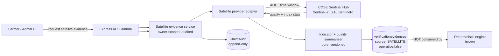

# Phase 13.1 — Satellite Verification Provider Feasibility & Architecture Audit

Status: **research / architecture only. No application code changed, no satellite provider integrated, no
credentials added, no imagery downloaded or persisted, no commit/push/PR/deploy.**

Scope discipline: this document answers — **can a satellite provider be used to produce *supporting* evidence
for an agricultural loss/affected-area claim, what provider(s) should be used, how should it integrate, and
what are the scientific, legal, operational, and cost realities?** It deliberately stops before
implementation. The `SATELLITE` evidence source in the Phase 11 foundation remains **non-operative** and is
**not** consumed by the deterministic engine.

> **How to read the evidence labels used below**
> - **[Verified]** — stated in an official provider/agency source (ESA / Copernicus / Microsoft / Google) or in this repository.
> - **[Inference]** — an engineering conclusion drawn from the verified facts; not asserted by the provider.
> - **[Unknown]** — genuinely open; must be confirmed with the provider or a proof-of-concept before relying on it.

---

## 1. Executive Summary

Satellite Earth observation is **scientifically feasible** and **practically useful** as **supporting evidence**
for crop-loss / affected-area claims, but it is **not** a substitute for the authoritative geometry the
backend already computes (ADR-019 P4), and it can never make a verification decision.

Key conclusions:

1. **Provider recommendation: Copernicus Sentinel data via the Copernicus Data Space Ecosystem (CDSE)
   Sentinel Hub APIs**, with **Sentinel-2 L2A** as the primary optical source and **Sentinel-1 SAR** as a
   monsoon/cloud fallback. Sentinel data is free and open, including for commercial use, and CDSE is the
   official ESA gateway with a free tier inside a monthly quota. [Verified]
2. **Do not build the product on Google Earth Engine's free tier.** GEE is only free for non-commercial /
   research / qualifying-government use; commercial use requires a paid contract. A verification product is
   commercial. [Verified]
3. **Optical imagery is unreliable during the South-Asian monsoon.** Persistent tropical/monsoon cloud cover
   is a well-documented limitation of Sentinel-2 for crop monitoring in India and Southeast Asia; Sentinel-1
   SAR (C-band, all-weather) is the established mitigation. [Verified across ESA + peer-reviewed literature]
4. **Resolution suits parcels, not field boundaries.** 10 m/pixel is adequate to observe vegetation vigour over
   a multi-pixel parcel but **cannot** authoritatively define field boundaries or acreage — which is exactly why
   area must remain a backend geometric calculation. [Verified fact + inference]
5. **The safe integration shape is an *adapter* that produces `VerificationEvidence` rows with
   `source:"SATELLITE"`, `operative:false`**, reusing the Phase 11 foundation and the existing audit. It adds
   **no new claim state, no new decision rule, and no engine change**. [Inference, consistent with Phases 11–12]
6. **Cost at pilot scale is effectively bounded by the CDSE free tier** (monthly processing-unit quota). The
   dominant long-run costs are engineering/ops and any scale-up beyond free-tier quota — not per-image licence
   fees. [Verified free-tier structure + inference]
7. **Recommended next step: a bounded, non-production proof-of-concept (Phase 13.2)** that computes a
   cloud-masked vegetation-index time series for one AOI and writes **no** production data and **no** claim
   state. [Recommendation]

**No satellite integration was implemented in this phase** (see §15).

---

## 2. Existing Architecture Audit

Audited the current claim/verification stack to find where satellite evidence could safely attach. Findings:

- **Claim model** is `models/LossClaim.js` with the frozen 10-state lifecycle; state changes are centralized in
  `services/claimState.service.js`. Satellite evidence must **not** create or alter states.
- **Deterministic engine** is `services/claimVerificationEngine.service.js` (pure; precedence
  timeliness → eventType → area → overlap/spatial → weather supporting-only → AI), orchestrated by
  `services/claimVerification.service.js`. It consumes only `{ claim, assessment, overlap, spatial,
  eligibleContext, weatherCorrelation, evidenceCount, now }`. **Adding a satellite signal to the engine would be
  a decision-rule change requiring a new ADR** — out of scope here.
- **Area authority** is `services/parcelGeometry.service.js` (spherical-excess area, WGS84, `1 acre =
  4046.8564224 m²`, round-4). Spatial overlap uses `services/claimSpatial.service.js` (Turf.js). **Satellite
  must never replace these.**
- **AI boundary** (`models/ClaimAssessment.js`, `services/claimAssessment.service.js`) is a **frozen per-image
  contract**; acreage/polygon/compensation/status are structurally impossible to persist. Satellite outputs are a
  different modality and must not be smuggled into the AI observation contract.
- **Generic evidence foundation** exists: `models/VerificationEvidence.js` + pure `utils/verificationEvidence.js`
  (`EVIDENCE_SOURCES` already includes `SATELLITE`, `EVIDENCE_STATUSES`, `OPERATIVE_EVIDENCE_SOURCES`,
  `buildVerificationEvidence`, forbidden-key guard). `services/verificationEvidence.service.js` is the internal,
  owner-scoped, audited writer. Phase 12 already proved the pattern with `source:"OWNERSHIP"`, additively, with
  **no** engine coupling.
- **Private storage** is the owner-scoped presigned-S3 pipeline (`services/uploadPresign.service.js`,
  `services/s3.service.js`, `routes/upload.js`) — **images only** and separate from satellite products.
- **Existing external-data pattern to mirror**: `services/weather.service.js` + `config/weather.js` (30-min TTL
  cache, 5 s fetch timeout, stale-honoured-1 h degradation, keyless Open-Meteo, `userAgent`). Satellite should
  reuse the same defensive posture (timeout, caching, graceful degradation, never block a response).
- **Audit** is append-only: `models/ClaimAudit.js` (actor `farmer | engine | admin`) and `models/AdminAction.js`.
  Satellite ingestion/reuse should be audited the same way.
- **Deployment**: Lambda via `serverless-http`; env validated by `config/env.js`
  (`SERVER_REQUIRED`/`CHAT_REQUIRED`/`INGEST_REQUIRED`/`S3_REQUIRED`). New provider config must be added
  **additively** and validated lazily so unprovisioned environments still boot (as S3 already does).

**Conclusion:** the correct integration shape is a **new, self-contained satellite adapter/service that writes
non-operative `SATELLITE` evidence rows** and touches **no** frozen surface. This mirrors Phase 12 and is
additive/reversible.

---

## 3. Official Sources & Citations

All provider claims below come from official documentation or recognised literature. **[Verified]** items cite
these.

| # | Source | Used for |
|---|---|---|
| S1 | ESA — Sentinel-2 mission & Facts and figures — `esa.int/.../Copernicus/Sentinel-2` | bands, 10 m, 13 bands, 290 km swath, 5-day revisit, 786 km SSO, free/open |
| S2 | ESA — Sentinel-2 User Handbook (ESA standard doc) | band→resolution mapping (B2/B3/B4/B8 @10 m; B5/B6/B7/B8a/B11/B12 @20 m; B1/B9/B10 @60 m) |
| S3 | Copernicus Data Space Ecosystem — Sentinel-2 documentation & Sentinel-1 documentation — `documentation.dataspace.copernicus.eu` | L2A products, SCL, archive dates, SAR all-weather, free/open |
| S4 | Copernicus Data Space Ecosystem — APIs (OData/STAC/Sentinel Hub/openEO/S3), Quotas, Processing Unit definition — `documentation.dataspace.copernicus.eu` | CDSE API surface, monthly quota, 1 PU = 512×512 / 3 bands / 1 sample / ≤16-bit; monthly reset; over-quota throttle |
| S5 | Copernicus Sentinel Data Legal Notice / CDSE Terms | free, full, open basis incl. reproduction/distribution/modification; commercial use allowed |
| S6 | Sentinel Hub — Processing API & commercial-data FAQ — `sentinel-hub.com` | Processing API purpose; commercial/third-party collections require purchase; attribution "Modified Copernicus Sentinel data [Year]/Sentinel Hub" |
| S7 | ESA — Sentinel-1 Instrument/operations & "10 ways" article | C-band SAR, all-weather day/night, IW 250 km swath, 5×20 m, 12-day (6-day constellation) repeat, flood/rice monitoring |
| S8 | Google Earth Engine Terms of Service / noncommercial page — `earthengine.google.com` | free only for non-commercial/research/qualifying government; commercial requires fee; noncommercial tiers recurring since Apr 2026 |
| S9 | Microsoft Planetary Computer — docs & STAC API — `planetarycomputer.microsoft.com` | petabytes hosted on Azure, STAC public/anonymous, most data download free but throttled; Sentinel-2 L2A from 2016 |
| S10 | Peer-reviewed literature (MDPI *Remote Sensing* 2020 "Synergistic Use of Radar and Optical… Monsoon Cropland Mapping in India"; ESSD 2024 "Monsoon Asia Rice Calendar" MARC; T&F *Geo-spatial Information Science* 2026 MSEA cloud study; ESSD SEA cropland 2026) | persistent monsoon cloud limitation for optical; Sentinel-1/2 fusion standard mitigation; NDVI index definition and cloud masking practice (QA60/SCL/s2cloudless) |

NDVI definition used below — `NDVI = (NIR − Red) / (NIR + Red) = (B8 − B4)/(B8 + B4)`, range −1…+1 — is the
standard published formula and is supported by Sentinel Hub custom scripts and the peer-reviewed sources [S10].

---

## 4. Provider Comparison

| Criterion | **CDSE Sentinel Hub (Sentinel-2/1)** | **Google Earth Engine** | **Microsoft Planetary Computer** | **Commercial (Planet/Maxar via Sentinel Hub)** |
|---|---|---|---|---|
| Data licence for commercial use | Free, full, open (Copernicus) [S5] | Free **only** non-commercial/research/qualifying-gov [S8] | Open data, free to access [S9] | Paid licence required [S6] |
| Optical resolution / bands | 10 m (B2/B3/B4/B8), 20 m, 60 m; 13 bands [S1,S2] | Hosts Sentinel-2 (same data) | Hosts Sentinel-2 L2A (same data) [S9] | PlanetScope ~3 m / SkySat / WorldView sub-meter [S6] |
| Revisit (optical) | 5 days equator (2-3 days mid-lat), ~10 days single sat [S1] | Same source imagery | Same source imagery | Daily (PlanetScope) possible [S6] |
| SAR (cloud-independent) | Sentinel-1 C-band, all-weather, 6-12 day [S7] | Sentinel-1 available | Sentinel-1 available | Possibly commercial SAR (costly) |
| Query / compute API | REST: Catalogue/STAC, Sentinel Hub Process/Statistical API, openEO, S3 [S4] | Python/JS API, server-side compute (must be licensed) [S8] | Public STAC + Data API; you compute [S9] | Sentinel Hub APIs + purchase [S6] |
| Free tier | Yes — monthly CDSE quota (requests & processing units) [S4] | Yes but non-commercial only [S8] | Yes (public, throttled) [S9] | No (free trial subject to licence) [S6] |
| Fit for a **commercial** verification product | **Strong** (open licence + free tier + managed processing + SAR) | **Poor** without paid licence | **Good** as an open catalog / fallback; more self-managed | Only if sub-10 m/daily is justified |
| Verdict | **Primary recommendation** | Not without a commercial contract | Secondary / fallback | Deferred (not needed at pilot) |

**Notes (verified vs unknown):**
- A third-party secondary source describes CDSE general-user quotas as roughly a rolling 30-day download
  allowance plus a monthly openEO credit pool and a rate-limited Sentinel Hub free tier. **These exact numbers
  are [Unknown] to us** — treat them as unverified; confirm current values at
  `documentation.dataspace.copernicus.eu/Quotas.html` before any cost commitment.
- Over-quota behaviour (degraded rate, not data loss) and monthly reset/non-carry-over are [Verified] [S4].
- Any figures for commercial per-hectare packages must be obtained from the vendor; **not** estimated here.

---

## 5. Scientific Feasibility Assessment

**What satellite data can and cannot show.** [Verified capabilites; inference for claim framing]

| Can support (supporting evidence only) | Cannot do (must remain backend/authoritative) |
|---|---|
| Vegetation vigour / greenness trend (NDVI, and related indices) over the parcel pixels | Authoritative acreage or boundary (10 m GSD; mixed pixels) [S1,S2] |
| Detect severe, spatially extensive standing-crop loss / bare-soil or water signatures (esp. with SAR) | Determine legal cause, ownership, or eligibility (no satellite basis) |
| Detect flood/water-logging signals (Sentinel-1 especially) [S7] | Make the verification decision (engine + ADR-019 P4) |
| Provide temporal context (before/after event window) | Prove a specific date/time of loss from a single optical pass (cloud gaps) |

**Signal quality realities (all [Verified] unless noted):**
- **Cloud is the dominant limiter.** Tropical/monsoon regions have persistent cloud; the literature states that
  during the first 2–3 months of the monsoon it is often impossible to obtain a cloud-free optical mosaic, and
  recommends SAR fusion [S10]. **[Inference] therefore: an optical-only workflow will fail or produce
  `UNAVAILABLE`/`INSUFFICIENT` for a meaningful share of Tamil Nadu / Andhra Pradesh claims during the kharif
  monsoon.** This is a *correct and honest* outcome, not a defect — per the design boundary, missing imagery
  must never become a negative finding.
- **Parcel scale.** A 1-hectare parcel is ~100 m × 100 m = ~10×10 pixels at 10 m. Vegetation indices over so few
  pixels are usable *in aggregate* but sensitive to mixed pixels, boundary bleed, and geolocation error.
  **[Inference] set a minimum viable AOI size and treat sub-threshold parcels as `INSUFFICIENT`.**
- **Cloud masking is a required step.** Use the L2A Scene Classification Layer (SCL) and/or a cloud-probability
  model (e.g., s2cloudless), following published practice [S3,S10]. QA60 (older L1C) and SCL (L2A) are the
  documented masks.
- **SAR is not a drop-in optical replacement.** It is not a simple "damage detector"; it informs structure,
  moisture, and water/change over time [S7,S10]. **[Inference] SAR is a robustness layer, not a primary damage
  classifier, at this maturity.**

**Feasibility verdict:** producing **honest, non-authoritative supporting observations** (cloud-aware vegetation
and water/change summaries with explicit quality/unavailability) is feasible. Claiming acreage, cause, or a final
decision from satellite is **not** feasible and is explicitly prohibited.

---

## 6. India / Tamil Nadu / Andhra Pradesh Considerations

- **Geography in scope:** Tamil Nadu (the product's home) and Andhra Pradesh are tropical with a strong
  south-west (Jun–Sep) and north-east (Oct–Dec) monsoon; heavy cloud during the main crop seasons is expected
  [S10, Inference].
- **Smallholder fragmentation:** fields are small and mixed; 10 m pixels commonly span multiple land covers
  [S10]. **[Inference] authoritative boundaries cannot come from satellite; the farmer-drawn parcel polygon
  remains the ONLY area authority (ADR-019 P1/P4).**
- **Event alignment:** the claim window (default 30 days, `CLAIM_WINDOW_DAYS`) defines the analysis window. The
  backend is authoritative for the window [ADR-019 P2]; satellite must analyse **within** it and report
  unavailable observations honestly.
- **Provider access from India:** all three recommended open sources (CDSE, Planetary Computer, GEE-hosted
  Sentinel data) are globally reachable; no regional restriction is documented. **[Unknown:** CDSE is EU-hosted;
  confirm acceptable latency/throughput from the deployment region, and confirm no data-residency requirement is
  triggered (satellite data is non-personal).]
- **Legal/licence:** Copernicus Sentinel data may be reproduced, distributed, and modified, including
  commercially, with attribution [S5]. **[Inference] add the required attribution string (e.g., "Contains modified
  Copernicus Sentinel data [Year]") to any surface that displays derived satellite results.**
- **Privacy:** requested AOI is a parcel polygon (location data). It is already stored by the product; sending it
  to a provider is a processing activity that should be covered by the consent/retention framework (SEC-13,
  DPDP readiness). No personal identifiers are sent.
- **Do not use satellite to infer government scheme eligibility or compensation.** No such rule exists in the
  repo and none should be invented here.

---

## 7. Recommended Architecture

**Pattern: a provider-agnostic satellite adapter feeding the existing evidence foundation — nothing else.**



**Components (all additive):**

1. **`config/satellite.js`** — provider base URLs, timeouts, cache TTL, cloud threshold, minimum AOI, enabled
   indicator set, `SATELLITE_PROVIDER` selector. Validated **lazily** (like `s3.service.js`) so environments
   without satellite config still boot.
2. **`services/satellite/` adapter** — a narrow interface, no vendor SDK types leaking into business logic:
   - `discoverImagery({ aoi, start, end, collection })` → candidate scenes (id, datetime, cloud cover, tiler
     URL / stats handle).
   - `assessQuality(candidate)` → cloud/quality mask summary.
   - `selectScenes(candidates, { cloudMax, maxScenes })` → deterministic temporal selection.
   - `computeIndicators({ aoi, scenes, indicators })` → per-window/aggregate statistics (e.g., NDVI/NDWI means,
     valid-pixel counts) — computed server-side (Sentinel Hub Statistical API or equivalent).
   - Providers: `cdse-sentinel` (primary), optional `planetary-computer` (fallback). Selected by config.
3. **`utils/satelliteEvidence.js`** — pure vocabulary + validation + fingerprint (mirrors
   `utils/ownershipEvidence.js` / `utils/verificationEvidence.js`). Defines indicator enum, quality states,
   outcome resolution (**never** `VERIFIED`), forbidden keys.
4. **`services/satelliteEvidence.service.js`** — owner-scoped orchestration: validate claim/parcel ownership
   (404 for foreign), resolve AOI from the **server-stored** claim/parcel geometry, call adapter with a timeout,
   summarise, persist a `SATELLITE` `VerificationEvidence` row, append `ClaimAudit(satellite_evidence_recorded)`.
   Degrade to `UNAVAILABLE`/`INSUFFICIENT` — never throw a decision, never block.
5. **Thin controller + routes** (owner read/submit; optional admin read) reusing existing limiters
   (`evidenceLimiter`/`adminLimiter`) and zod validation.

**Hard boundaries (unchanged):**
- Satellite evidence is **`operative:false`** and is **not** imported by the engine or the AI assessment.
- AOI is **always** the server-stored parcel/claim polygon — never a client-supplied shape.
- No raw imagery is persisted by default; store **references + derived summaries** (on-demand build), keeping
  storage, cost, and licence exposure minimal. Any imagery caching is a separate, explicit decision.
- No new claim state, no decision rule, no fee/compensation logic.

---

## 8. Proposed Evidence Contract

Reuses Phase 11 `VerificationEvidence` with `source:"SATELLITE"` (already in `EVIDENCE_SOURCES`). **Additive;
no schema migration required** if stored in the existing flexible `metadata`/`result` fields.

```
source            "SATELLITE"
status            one of EVIDENCE_STATUSES[]. Recommended: AVAILABLE | INSUFFICIENT | UNAVAILABLE
                  (PENDING while the provider call is in flight; VERIFIED is NOT reachable)
operative         false
reference         provider product/scene id(s) (opaque; deterministic derived id if none)
evidenceVersion   sha1 fingerprint of { collection, acquisition window, sceneIds, indicators, processingVersion }
evaluationVersion "1"
idempotencyKey    "sat_<claimId>_<windowHash>_<indicatorSetHash>"  (DB partial-unique {claimId, idempotencyKey})
metadata          {
                    parcelId,
                    provider,                 // "cdse-sentinel" | ...
                    collection,               // e.g., "sentinel-2-l2a", optional "sentinel-1-grd"
                    productLevel,             // e.g., "L2A"
                    analysisWindow: { start, end },
                    acquisitionDates: [ ... ],
                    sceneCount, validObservationCount,
                    cloudMaxFraction, cloudMaskMethod,   // "SCL" | "s2cloudless" | ...
                    spatialResolutionM,
                    indicators: { ndviMean, ndviDelta, ndwiMean, ... },  // numeric summaries only
                    geometryVersion,          // ties to the authoritative parcel/claim geometry version
                    processingVersion
                  }
result            { quality, notes, unavailableReason? }   // human-readable, no authority claims
provider          "cdse-sentinel"   // WHICH integration produced it, NOT authority
```

**Semantics / rules:**
- Satellite is **supporting evidence**; it never sets `authoritative:true` and never emits `VERIFIED`.
- Missing/obscured imagery → `UNAVAILABLE` / `INSUFFICIENT` with a reason; **never** a negative finding.
- Numeric summaries are the **only** quantitative fields persisted (no rasters, no boundaries, no acreage).
- The `geometryVersion` field binds the observation to the exact authoritative geometry it was computed against.

---

## 9. Security & Operational Requirements

- **Secrets**: CDSE/Sentinel Hub client credentials (OAuth client) stored in **AWS Secrets Manager / SSM**, read at
  runtime; never in the repo, logs, or client. Add provider config to `config/env.js` additively and validate
  lazily.
- **SSRF prevention**: never fetch a user-supplied URL/shape. AOI comes only from server-stored geometry;
  outbound calls go only to a fixed allow-list of provider base URLs.
- **Identity/ownership**: all reads/submits scoped by `cognitoSub`; foreign claim/parcel → **404** (existing
  convention). Admin reads reuse `requireRole("admin")`.
- **Rate/quota control**: account for provider quota. Per-user request limiting (existing `evidenceLimiter`) plus
  a **server-side quota/usage guard** (cache hits, coalescing) to stay inside the CDSE monthly quota. 429 with
  `Retry-After` on exhaustion; degrade to cached/`UNAVAILABLE` rather than error storms.
- **Resilience**: mirror `weather.service.js` — explicit timeout (e.g., seconds), bounded retries, stale-cache
  honouring, and graceful `UNAVAILABLE`. Upstream failure must **never** block a claim decision or fabricate
  evidence.
- **Audit**: append-only `ClaimAudit` (e.g., `satellite_evidence_recorded` / `satellite_evidence_unavailable`)
  with `requestId`; **no** keys, scene tokens, or AOI coordinates beyond what is already stored for the claim.
- **Determinism & reproducibility**: version the processing/indicator method (`processingVersion`) and the
  geometry version; identical inputs → identical evidence fingerprint.
- **Attribution**: display the Copernicus attribution string wherever derived satellite results are shown [S5,S6].
- **Privacy**: only non-personal parcel geometry is transmitted; document the processing activity under the
  consent/retention framework (SEC-13).
- **No decision authority**: enforce in code and tests that satellite evidence cannot enter the engine or the AI
  assessment, and can never trigger approve/reject.

---

## 10. Cost & Provider Recommendation

**Recommendation:** **Copernicus Sentinel-2 L2A (primary) + Sentinel-1 (fallback) via CDSE Sentinel Hub APIs**,
with **Microsoft Planetary Computer** as an optional open fallback catalog. **Do not** depend on Google Earth
Engine's free tier for a commercial product. **Defer** any commercial high-resolution imagery until a concrete
need is proven.

**Cost structure (what is [Verified] vs estimated):**
- **Data licence**: Copernicus Sentinel data is [Verified] free and open, including commercial use, with
  attribution. This is the single biggest cost advantage.
- **Free tier**: [Verified] CDSE enforces **monthly** quotas (requests + processing units), reset on the 1st, not
  carried over; over-quota users are moved to a slower interface (access continues) [S4]. **Exact current numbers
  are [Unknown] — confirm in the CDSE Quotas page before committing.**
- **Processing unit basis**: [Verified] `1 PU = 512×512 px output, 3 input bands, 1 sample/pixel, ≤16-bit, no
  extra processing`; minimum 0.005 PU (Process API) / 0.01 PU (Statistical API) per request [S4].

  **[Inference] illustrative pilot estimate (not a quote):** a small parcel AOI (≈ up to a few hundred metres
  across) **fits inside one 512×512 output**, and a multi-date index summary is **one Statistical API call per
  analysis window**, i.e., **on the order of the minimum (≈0.01 PU)** per request plus multipliers for extra
  bands/samples. At pilot scale (tens–hundreds of claims/month) this is expected to sit inside the **free** CDSE
  quota. Validate with a PoC; **do not** present these as contractual costs.
- **Scale-up**: beyond free quota, CDSE commercial / CREODIAS Sentinel Hub offers paid quota (top-up packages,
  per-PU pricing) [S4,S6]. Get current pricing from the vendor before any commitment.
- **Engineering/ops cost** (caching, quota guard, adapter maintenance, monitoring) is the real long-run cost and
  is independent of the (free) data.

**Bottom line:** the pilot is near-zero marginal cost on open Copernicus data; the meaningful spend is
engineering and any paid quota after product-market fit.

---

## 11. Proof-of-Concept Plan (Phase 13.2 — proposed, NOT executed)

A bounded, **non-production** spike to de-risk the four unknowns: cloud availability, parcel-scale signal,
quota shape, and adapter ergonomics.

**Constraints (carry forward):** no real farmer PII; no production writes; no claim-state changes; no engine
change; no commit without review; credentials only via local secret config, never committed.

**Steps:**
1. **Select 1–3 representative AOIs** — public/known parcels or synthetic ~1 ha polygons in TN and AP across a
   monsoon month and a dry month (no real claimant data).
2. **Authenticate to CDSE** with a scoped client; **enumerate available Sentinel-2 L2A scenes** in the window;
   record scene count and cloud metadata (`eo:cloud_cover`).
3. **Cloud-mask** (SCL and/or s2cloudless) and compute **NDVI (B8,B4)** and a water index (e.g., NDWI) summary
   over each AOI per usable scene; record `validObservationCount`.
4. **Repeat with Sentinel-1** for the same AOIs/windows to measure the improvement in usable observations.
5. **Record findings**: how often optical is usable in-monsoon vs dry; feasibility of a minimum-AOI threshold;
   measured PU/requests consumed; latency.
6. **Prototype the adapter interface** behind a feature flag **without wiring it to any route or engine**
   (or, strictly, document the interface only and write no application code in 13.2 unless approved).
7. **Deliver** a short PoC report + a go/no-go recommendation for Phase 13.3.

**Success criteria:** ≥1 usable observation in a majority of dry-season AOIs; documented monsoon availability;
a defensible minimum-AOI threshold; quota headroom confirmed; adapter interface shown to be cleanly isolatable.

---

## 12. Future Implementation Phases (proposed roadmap)

| Phase | Deliverable | Adds | Does NOT add |
|---|---|---|---|
| **13.1** (this) | Feasibility & architecture report | — (docs only) | any code |
| **13.2** | PoC + adapter prototype (feature-flagged) | read-only provider calls | routes, persistence of production data, engine use |
| **13.3** | `utils/satelliteEvidence.js` + `services/satelliteEvidence.service.js` + `config/satellite.js` | `SATELLITE` evidence rows (`operative:false`), audit, quota guard | new state, decision rule, engine coupling |
| **13.4** | Owner-facing read/attach endpoints + admin read | thin routes + zod, existing limiters | UI authority claims, auto-decisions |
| **13.5** | SAR fusion + indicator hardening | Sentinel-1 fallback, better quality model | acreage/authority from satellite |
| **13.6** (gated) | *Optional* engine consideration — **only with a new ADR** | a configurable, tested supporting signal | hard thresholds; absence-of-data rejection |

Each phase stays additive and reversible, exactly like Phases 11–12.

---

## 13. Risks, Assumptions, Unresolved Questions

**Risks**
- **Cloud/monsoon unavailability** → many `UNAVAILABLE`/`INSUFFICIENT` outcomes. Mitigation: SAR fallback; honest
  statuses; never a negative finding. [High likelihood in kharif]
- **Smallholder mixed pixels** → weak parcel-level signal. Mitigation: minimum-AOI threshold; aggregate indices.
- **Over-interpretation risk** → users/loans treating satellite as proof. Mitigation: labels, `operative:false`,
  attribution, no authority language, no acreage output.
- **Quota exhaustion / cost spike** at scale. Mitigation: caching, coalescing, quota guard, degradation.
- **Provider change/outage** → Mitigation: adapter abstraction + Planetary Computer fallback.
- **Licence drift** (changes to free/open terms, or third-party collections) → Mitigation: pin to Copernicus
  Sentinel open data; re-verify terms.
- **Privacy/consent** for parcel geometry processing → Mitigation: cover under SEC-13 framework.

**Assumptions**
- The backend remains the sole area/boundary authority (ADR-019 P4) — satellite is supporting only.
- `SATELLITE` stays non-operative until a separately-approved ADR changes that.
- Provider credentials can be managed in AWS Secrets Manager.
- CDSE free tier is sufficient for the pilot (to be confirmed).

**Unresolved questions ([Unknown])**
- Exact current CDSE free-tier quota values (requests/PU per month) and scale-up pricing.
- Which indicator set is most defensible for loss claims (NDVI alone vs NDVI+NDWI+SAR change).
- Minimum viable AOI size / minimum pixel count for a trustworthy summary.
- Optimal analysis window relative to the claim event date (whole window vs pre/post split).
- Whether to persist any derived composites or keep everything on-demand.
- Whether Sentinel-1 should be in the MVP or deferred to 13.5.
- Any latency/throughput implications of EU-hosted CDSE endpoints from the deployment region.

---

## 14. Exact Files Inspected & Files Changed

**Files inspected (read-only audit) — no modifications:**
- `backend/index.js`, `backend/app.js`, `backend/config/env.js`, `backend/config/weather.js`
- `backend/models/LossClaim.js` (referenced), `backend/models/ClaimAssessment.js`,
  `backend/models/VerificationEvidence.js` (referenced), `backend/models/WeatherCache.js` (referenced),
  `backend/models/AdminAction.js` (referenced), `backend/models/ClaimAudit.js` (referenced)
- `backend/services/claimVerificationEngine.service.js`, `backend/services/claimVerification.service.js`,
  `backend/services/claimSpatial.service.js`, `backend/services/parcelGeometry.service.js`,
  `backend/services/weather.service.js`, `backend/services/verificationEvidence.service.js` (referenced),
  `backend/services/ownershipEvidence.service.js` (referenced)
- `backend/utils/verificationEvidence.js` (referenced), `backend/utils/ownershipEvidence.js` (referenced)
- `backend/docs/product/PRODUCT_PRINCIPLES.md`, `backend/docs/product/AI_Product_Principles.md`
- `backend/docs/architecture/06_System_Architecture.md`, `backend/docs/architecture/07_Database_Design.md` (ref),
  `backend/docs/architecture/08_API_Documentation.md` (ref)
- `backend/docs/decisions/18_DECISIONS.md`, `backend/docs/planning/17_Backlog.md`,
  `backend/docs/planning/ARCHITECTURE_DECISIONS_PENDING.md`
- `backend/docs/engineering/14_Deployment.md`, `backend/docs/engineering/15_Security.md`
- `backend/PHASE_11_FINAL_REPORT.md`, `backend/PHASE_12_FINAL_REPORT.md`

**Official external sources cited:** see §3 (ESA Sentinel-2/Sentinel-1, Copernicus Data Space Ecosystem
documentation + Quotas + Processing Unit definition + Terms/Legal Notice, Sentinel Hub docs/FAQ, Google Earth
Engine ToS/noncommercial, Microsoft Planetary Computer docs/STAC, and peer-reviewed monsoon/SAR-fusion
literature).

**Files changed:**
- `backend/PHASE_13_1_SATELLITE_FEASIBILITY_REPORT.md` — **added (this document)**.

**No application code, model, service, route, controller, schema, config, test, or dependency was added or
modified.** All other `PHASE_*` reports are unchanged.

---

## 15. Explicit Confirmation — No Satellite Integration Implemented

This phase was **research and architecture only**. Confirmed:

- **No satellite provider was integrated.** There is no adapter, client, OAuth flow, API call, SDK, or
  dependency for CDSE / Sentinel Hub / Google Earth Engine / Planetary Computer / any commercial provider.
- **No application code was changed** — no `models/`, `services/`, `controllers/`, `routes/`, `utils/`,
  `config/`, `middlewares/`, `tests/`, or `app.js`/`index.js` edits.
- **No credentials or secrets** were created, stored, or committed.
- **No imagery or products** were downloaded, cached, or persisted.
- **No claim state, decision rule, engine behaviour, geometry/area authority, AI contract, or database schema
  was changed.** `SATELLITE` remains **non-operative**; `VERIFIED` remains unreachable.
- **No commit, push, PR, deploy, or AWS/production configuration change** was made.
- The **only** artifact produced is this report: `backend/PHASE_13_1_SATELLITE_FEASIBILITY_REPORT.md`.

STOP — awaiting review before any Phase 13.2 proof-of-concept work begins.
