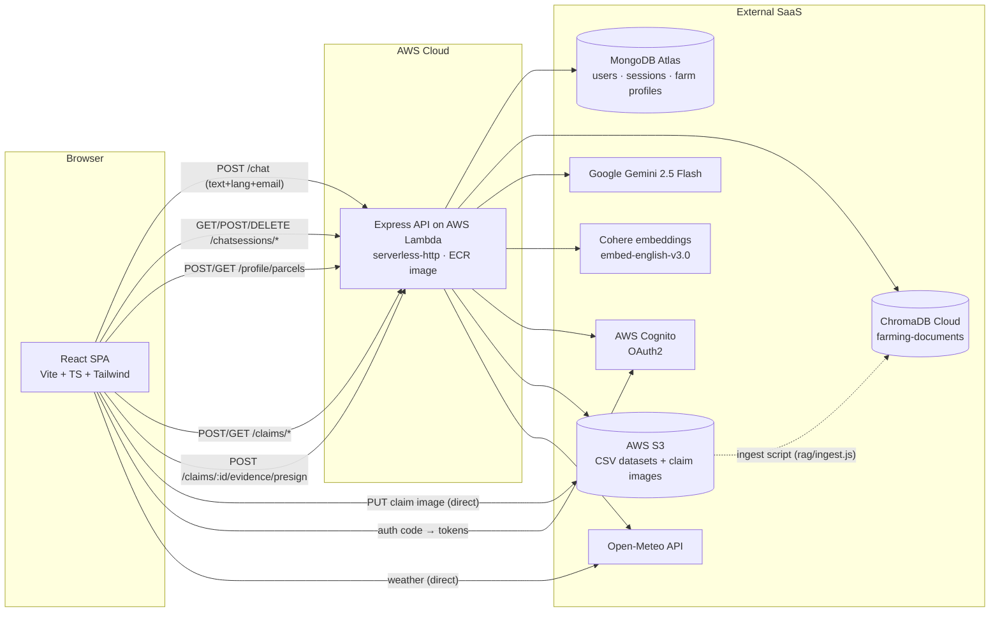
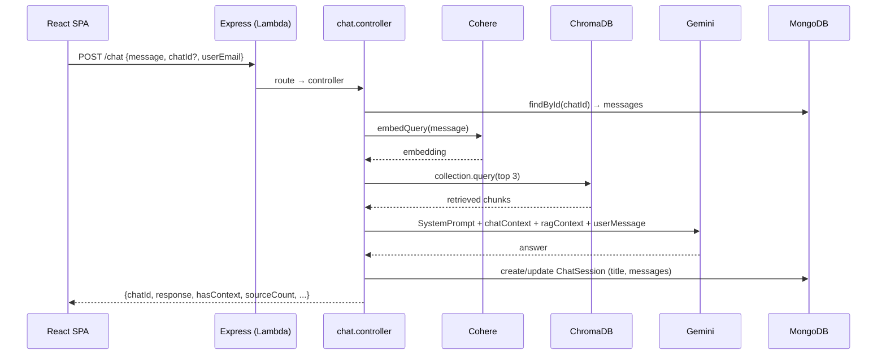
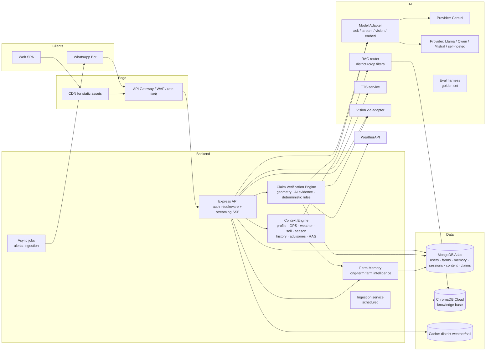

# 06 — System Architecture

> **Metadata**
> - **Title:** 06 — System Architecture
> - **Version:** 1.0
> - **Status:** `[ACTIVE]`
> - **Owner:** Engineering / Solution Architect
> - **Last Reviewed:** 2026-08-07
> - **Related Documents:** [07_Database_Design](07_Database_Design.md) · [08_API_Documentation](08_API_Documentation.md) · [09_AI_Architecture](09_AI_Architecture.md) · [12_Technical_Guidelines](../engineering/12_Technical_Guidelines.md) · [14_Deployment](../engineering/14_Deployment.md) · [15_Security](../engineering/15_Security.md) · [18_DECISIONS](../decisions/18_DECISIONS.md)

> **Why this document exists:** Gives every engineer and architect the same mental model of how the system is assembled today, where each component runs, and how data flows — plus the target architecture so future decisions are consistent. Diagrams use Mermaid.

---

## 1. Overall architecture (today)

The product is a **serverless monolith**: one Express API (wrapped with `serverless-http`) runs on AWS Lambda; a React SPA calls it from the browser; an external SaaS vector store (ChromaDB cloud) holds the knowledge base; MongoDB Atlas holds users, chat sessions, and farm profiles. Notably, **weather is fetched directly by the frontend** (Open-Meteo) and also via backend proxy; there is **no Context Engine, no Model Adapter, no Farm Memory, and no Agricultural Loss Claim system yet** (those are the vision-v2 target; see [AI_Product_Principles.md](../product/AI_Product_Principles.md)).



## 2. Frontend

| Aspect | Detail |
|---|---|
| Framework | React 18 + TypeScript (strict) |
| Build | Vite 5; Tailwind CSS 3; PostCSS |
| State | React Context (auth) + local state; no server cache lib yet |
| Routing | None (single-page, conditional render in `App.tsx`) |
| i18n | i18next with hand-rolled `en`/`ta` dictionaries |
| Auth | Browser-side OAuth2 authorization-code flow against Cognito; `id_token` + user JSON stored in `localStorage` |
| Weather | `farmerWeatherService.ts` — geolocation → nearest of 38 TN districts → Open-Meteo → farmer-friendly formatting; "demo" mode outside TN |
| Voice | `react-hook-speech-to-text` (browser Web Speech API) |
| Notifications | Sonner toasts |
| Key flows | Login screen (weather + Google login) → language selection → chat (sidebar + interface) |

**Known gaps (see 04_Feature_List F-15/F-16/F-18):** image preview only (backend accepts authenticated multipart upload since E3-S1; S3 storage is E3-S2 pending D-23); audio playback affordance with no TTS; two session-API conventions; raw `fetch` calls instead of a typed API client; `@supabase/supabase-js` dependency installed but unused.

## 3. Backend

| Aspect | Detail |
|---|---|---|
| Framework | Express 5 (ESM), `serverless-http` wrapper |
| Entry | `index.js` — strict CORS allow-list (`CORS_ORIGINS`), `express.json({ limit: '1mb' })`, top-level `await connectDB()`, mounts `/auth`, `/chat`, `/chatsessions`, `/weather`, `/profile` |
| Runtime | Node 24 (AWS Lambda base image), Docker → ECR |
| Module structure | `config/` · `controllers/` · `models/` · `routes/` · `rag/` · `utils/` |
| Deployment | GitHub Actions (`deploy-lambda.yml`) builds image, pushes to ECR, updates Lambda `tnFarmingAssistant` on push to `main` |
| AI integration (today) | `chat.controller` calls **Gemini directly** (`ChatGoogleGenerativeAI`) — no adapter layer yet (F-45) |

### Request flow (chat)



> **Vision-v2 target for this flow (ADR-014):** after loading history, a **Context Engine** step assembles farm profile + GPS + weather + soil + season + crop history + advisories + RAG into one context snapshot, and the LLM call goes through a **Model Adapter** (not Gemini directly). See §9.

## 4. Database

- **MongoDB Atlas** (`farmingDB`), accessed via Mongoose.
- Collections: `users`, `chatsessions`, `queries`, `contexts`.
- `queries` and `contexts` are implemented but **not used** by the chat flow today (dead schema — see [07_Database_Design.md](07_Database_Design.md)).
- Chat history is stored as an **embedded array** on `ChatSession` (unbounded growth risk; see F-28).

## 5. AI layer

- **LLM:** Gemini 2.5 Flash (`ChatGoogleGenerativeAI`, `maxOutputTokens: 2048`) — **called directly today; a Model Adapter (F-45, ADR-015) will make the provider configurable** (Llama/Qwen/Mistral/self-hosted).
- **Embeddings:** Cohere `embed-english-v3.0` (1024 dims) — used for both ingestion and query.
- **Vector store:** ChromaDB Cloud, tenant `CHROMA_TENANT`, database `CHROMA_DATABASE`, collection `farming-documents`.
- **Ingestion:** `rag/ingest.js` — S3 CSV → split (1000 chars / 200 overlap) → Cohere embeddings → ChromaDB. Manual run; not scheduled.
- **Prompt:** one static system prompt (`utils/prompts.js`) with `{{...}}` placeholders that are **not substituted** (gap F-20 — to be filled by the Context Engine).
- **Memory:** last 6 messages appended as "Previous conversation context." Long-term **Farm Memory** (F-47) is planned.

Full detail: [09_AI_Architecture.md](09_AI_Architecture.md).

## 6. Authentication

```mermaid
flowchart LR
    FE[SPA] -->|1. /oauth2/authorize| Cognito[AWS Cognito]
    Cognito -->|2. redirect ?code=| FE
    FE -->|3. POST /oauth2/token| Cognito
    Cognito -->|4. id_token| FE
    FE -->|5. POST /auth/google {code}| API[Express Lambda]
    API -->|decode (NOT verified)| Cognito
    API -->|upsert user| DB[(MongoDB)]
    API -->|returns user + id_token| FE
```

**Security reality (critical):** the backend calls `jwt.decode(id_token)` **without verifying the signature**; subsequent APIs authorize by a `userEmail` field supplied by the client. This must be replaced (Phase 1) — see [15_Security.md](../engineering/15_Security.md).

## 7. Cloud & external APIs

| Service | Purpose | Access |
|---|---|---|
| AWS Cognito | OAuth2 IdP (Google federation) | env vars |
| AWS Lambda + ECR | Runtime host | IAM role (CI) |
| AWS S3 | Dataset source for ingestion | access keys (env) |
| MongoDB Atlas | Persistence | connection string (env) |
| ChromaDB Cloud | Vector store | API key/tenant/db (env) |
| Google Gemini | LLM (text) | API key (env) |
| Cohere | Embeddings | API key (env) |
| Open-Meteo | Weather (frontend-direct) | public, no key |

> All keys are currently in local `.env` files. `.env` files are **git-ignored** (verified), but **must be rotated and migrated to managed secrets** in Phase 1 (see [15_Security.md](../engineering/15_Security.md)).

## 8. Deployment

- **Backend:** GitHub Actions on push to `main` → Docker build → ECR (`vivasayiai-lambda`) → `lambda update-function-code` → Lambda `tnFarmingAssistant`.
- **Frontend:** not yet deployed (dev server only).
- **Local:** backend `npm run dev` (nodemon, port 8000); frontend `npm run dev` (Vite, port 5173).
- **Dockerfile:** `public.ecr.aws/lambda/nodejs:24`, `npm install --production`, `CMD ["index.handler"]`.

Full detail: [14_Deployment.md](../engineering/14_Deployment.md).

## 9. Target architecture (Phase 1-2)



**Key changes vs today:** auth middleware; **Context Engine** assembles context before every LLM call (F-46, ADR-014); **Model Adapter** makes the provider swappable by config (F-45, ADR-015); **Farm Memory** persists farm intelligence (F-47, ADR-016); **Claim Verification Engine** computes authoritative geometry, runs AI evidence analysis, applies deterministic rules (**implemented in Phase 5 / E9-S5**; pure engine + orchestration service; overlap unchecked E9-S6; pHash/fraud deferred) and is now reachable through a **thin public endpoint `POST /claims/:claimId/verify` (Phase 6 integration slice)** — authenticated, ownership-scoped, `claimLimiter` + params-only validation, no request-body contract; the server loads the authoritative claim/evidence/assessment, runs the frozen rules, persists the decision, and advances the state via the centralized machine (idempotent decision reuse + atomic `submitted → processing` CAS). Weather/context proxy in backend; streaming; typed client; message pagination; scheduled ingestion; monitoring/alerting.

---

## 10. Architecture decisions (summary)

See [18_DECISIONS.md](../decisions/18_DECISIONS.md) for the full decision records (ADR-001 through ADR-017) and [AI_Product_Principles.md](../product/AI_Product_Principles.md) for the principles (APP-01…13) that bound them.
