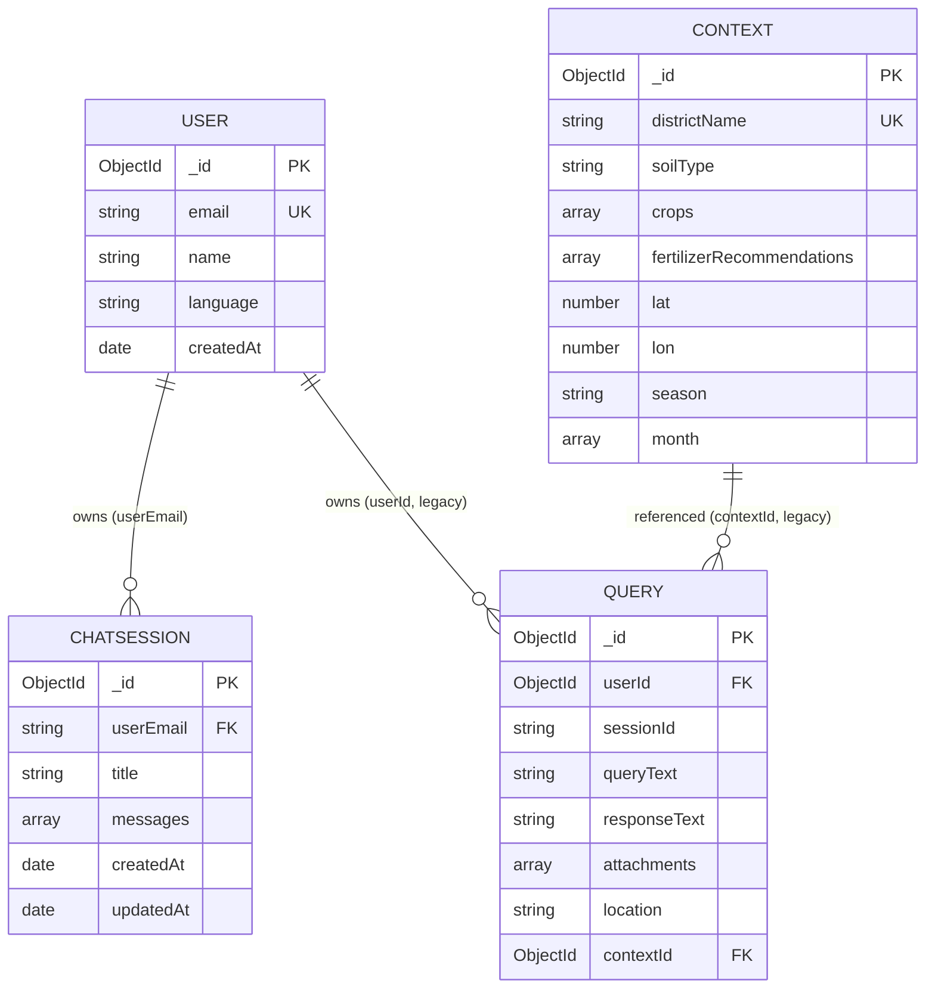
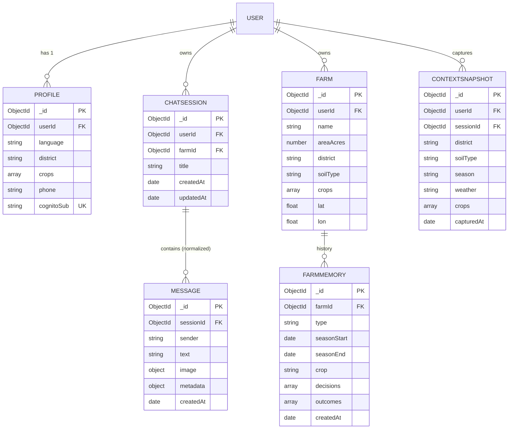

# 07 — Database Design

> **Metadata**
> - **Title:** 07 — Database Design
> - **Version:** 1.0
> - **Status:** `[ACTIVE]`
> - **Owner:** Backend / Data
> - **Last Reviewed:** 2026-08-07
> - **Related Documents:** [06_System_Architecture](06_System_Architecture.md) · [08_API_Documentation](08_API_Documentation.md) · [09_AI_Architecture](09_AI_Architecture.md) · [18_DECISIONS](../decisions/18_DECISIONS.md)

> **Why this document exists:** Defines every MongoDB collection, its fields, constraints, indexes, and relationships, plus the ER diagram and the schema changes planned for production. It is the reference for any query, migration, or schema decision.

**Database:** MongoDB Atlas, database name `farmingDB`, accessed via Mongoose (`mongoose@8`).
**ORM:** Mongoose models in `tn-farming-assistant/models/`.

---

## 1. Collections overview

| Collection | Model file | Purpose | Status |
|---|---|---|---|
| `users` | `User.js` | Authenticated users (from Cognito) | `[EXISTING]` used |
| `chatsessions` | `ChatSession.js` | Chat sessions + embedded messages | `[EXISTING]` used |
| `queries` | `Query.js` | Per-query logs with attachments/location | `[EXISTING]` schema, **unused** |
| `contexts` | `Context.js` | District soil/crop context | `[EXISTING]` schema, **unused** |

> **Note:** `queries` and `contexts` were designed for the capstone (context injection, query audit trail) but the chat flow never writes to them today. Under vision-v2, `contexts` becomes the seed for the **Context Engine's reference data** (districts/soil/season) and `queries` (or a successor) becomes the context-snapshot audit store (see §7). Phase 1 re-introduces their purpose via the redesigned Context Engine (F-20/F-46).

---

## 2. Collection: `users`

```js
{
  name:      String,            // from Cognito profile
  email:     String,            // UNIQUE — the current identity key
  language:  String,            // 'en' | 'ta' (field exists; not persisted by the app today)
  createdAt: Date,              // default now
}
```

- **Indexes:** `email` (unique, from schema).
- **Relationships:** 1 → N `chatsessions` (by `userEmail`), 1 → N `queries` (by `userId` — legacy).
- **Known gaps:**
  - No phone number, district, crops, or farm profile (planned F-21).
  - `language` is never updated server-side (`updateUserLanguage` is client-only).
  - Identity is email-string-based; must become `cognitoSub` (immutable, non-spoofable) in Phase 1 (F-19). **Done in E1-S3:** `User.cognitoSub` added (unique, sparse) and set at login; remaining collections (`profiles`/`chatsessions`) still keyed by `userEmail` pending E1-S4/(D-35) ownership scoping.

## 3. Collection: `chatsessions`

```js
{
  userEmail: String,             // owner key (today) — required, indexed
  title:     String,             // default "New Chat"; set from first message
  messages: [                    // EMBEDDED ARRAY
    {
      sender:    "user" | "ai" | "system",   // enum, required
      text:      String,                     // required
      timestamp: Date                        // default now
      // _id: false — subdocuments have NO ids
    }
  ],
  createdAt: Date,   // timestamps: true
  updatedAt: Date,
}
```

- **Indexes:** `userEmail` (1). No compound index.
- **Relationships:** N → 1 `users` (by `userEmail`).
- **API surface:** created via `POST /chatsessions/new`, appended via `POST /chatsessions/:id/message` or the `/chat` controller; listed via `GET /chatsessions/list/:email` and `GET /chat/sessions`.

### Known gaps & risks
| Issue | Impact | Plan |
|---|---|---|
| Messages stored as an **unbounded embedded array** | One document grows with every message; `slice(-6)` still loads the whole doc; Mongo 16MB doc limit is reachable in extreme cases | F-28: normalize `messages` into their own collection (or capped + archived) |
| No `_id` on messages | Frontend React keys fall back to indices; no stable message identity for edits/feedback | Part of F-28 |
| No pagination on list | `GET /chatsessions/list/:email` returns all sessions | Add limit/offset + cursor |
| No per-user limits | Storage growth with no cap | Add session/message quotas |
| `updatedAt` not bumped consistently by all endpoints | `POST /chatsessions/:id/message` relies on explicit saves; some paths set `updatedAt` manually | Rely on Mongoose timestamps |

## 4. Collection: `queries` (legacy / unused)

```js
{
  userId:        ObjectId,   // ref "User" — required
  sessionId:     String,     // optional grouping
  queryText:     String,     // required
  responseText:  String,     // AI answer
  attachments:   [String],   // image/file URLs
  location:      String,     // district or GPS
  contextId:     ObjectId,   // ref "Context"
  createdAt:     Date,
  updatedAt:     Date,
}
```

- **Indexes:** `{userId, createdAt: -1}`, `{userId, sessionId, createdAt: -1}`.
- **Status:** schema + controller CRUD exist (`/test/*`) but nothing in the chat flow uses it. Candidate for removal or revival as an audit/analytics store in Phase 1.

## 5. Collection: `contexts` (legacy / unused)

```js
{
  districtName:           String,   // UNIQUE — required
  soilType:               String,
  crops:                  [String], // major crops
  fertilizerRecommendations: [String],
  lat:                    Number,   // GPS matching
  lon:                    Number,
  season:                 String,   // Kharif/Rabi/Summer
  month:                  [String], // month-specific advice
  createdAt:              Date,
  updatedAt:              Date,
}
```

- **Indexes:** `districtName` (unique).
- **Status:** schema + CRUD exist, unused. The TN district coordinates currently live in the **frontend** (`src/config/tamilnaduDistricts.ts`, 38 districts) — the backend has no geo/soil data. Under vision-v2, this becomes the **Context Engine reference data store** (district → lat/lon/soil/crops/season) seeded server-side in Phase 1 (F-20, E2-S2) — the source of truth for automatic context (APP-03).

---

## 6. ER diagram (today)



## 7. Target schema (Phase 1-2, planned)



### Planned changes (rationale)
- **Immutable user identity:** `cognitoSub` (unique) added in E1-S3; keep `email` for display. Prevents email-spoofing across all queries (security).
- **Normalize messages** into a `messages` collection (or TTL-capped archive) to avoid unbounded documents and enable pagination (F-28).
- **Farm profile collections** (`profiles`, `farms`) to power personalization (F-21) and the Context Engine (F-46).
- **Farm Memory collection** (`farmmemory`): season-by-season crop history, decisions, and outcomes — the core memory capability (F-47, ADR-016).
- **Context snapshots** (`contextsnapshots`): every answer records the assembled context it used (district, soil, season, weather, crops) for traceability + eval (APP-03, APP-12).
- **Reference data:** seed `districts` (38 TN districts from frontend config + lat/lon + soil) and `knowledge-content` (curated, sourced) into the DB; keep authoritative source-of-truth server-side for the Context Engine.
- **Analytics/audit:** revive a `queries`-like store with consent flags, or use structured logs + a metrics store, for cost/quality analytics (F-27).

## 8. Migration & maintenance rules

1. Every schema change ships with a **migration note** recorded in [18_DECISIONS.md](../decisions/18_DECISIONS.md) and this document.
2. Add indexes **before** data volume demands them; use compound indexes aligned to query patterns.
3. Do not embed unbounded arrays; cap embedded arrays (e.g., recent 50) and archive the rest.
4. Sensitive PII (phone, precise location) must be **encrypted at rest** and **never logged** (see [15_Security.md](../engineering/15_Security.md)).
5. `districts`/reference data is the single source of truth server-side; the frontend copy is display-only.
