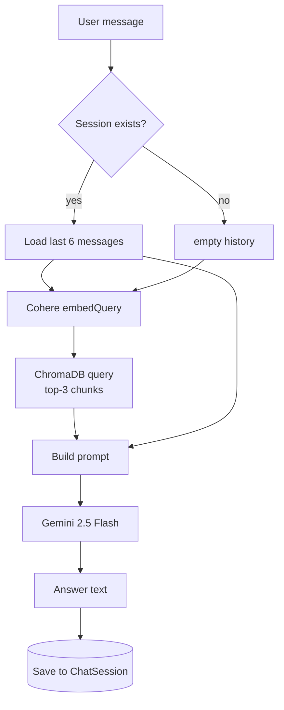
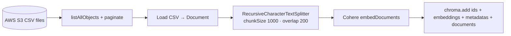
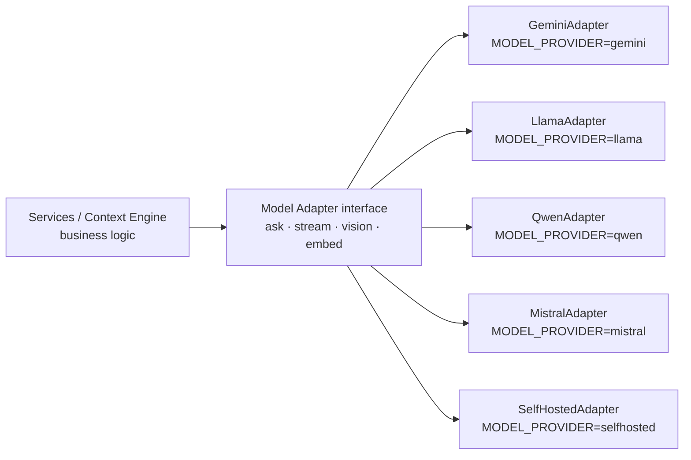
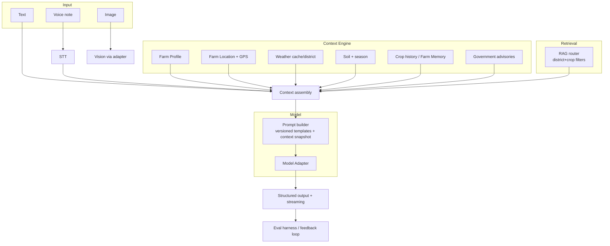
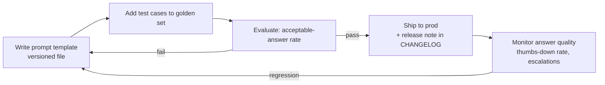

# 09 — AI Architecture

> **Metadata**
> - **Title:** 09 — AI Architecture
> - **Version:** 1.0
> - **Status:** `[ACTIVE]`
> - **Owner:** AI / Engineering
> - **Last Reviewed:** 2026-08-07
> - **Related Documents:** [06_System_Architecture](06_System_Architecture.md) · [07_Database_Design](07_Database_Design.md) · [08_API_Documentation](08_API_Documentation.md) · [13_Testing_Strategy](../engineering/13_Testing_Strategy.md) · [18_DECISIONS](../decisions/18_DECISIONS.md) · [AI_Product_Principles](../product/AI_Product_Principles.md) · [PRODUCT_PRINCIPLES](../product/PRODUCT_PRINCIPLES.md)

> **Why this document exists:** The AI layer is the heart of the product and the least obvious part of the codebase. This document explains the current pipeline (prompts, RAG, embeddings, vector DB, memory), where weather/voice/image sit (or don't), and the target AI architecture — Context Engine, Model Adapter, Farm Memory, and the AI diagnosis pipeline — plus the prompt lifecycle and evaluation.
>
> **Vision v2 (2026-08-07):** Vivasayi AI is a **Decision Platform, not a chatbot** (APP-01). The binding AI principles — zero-question context (APP-02), context before generation (APP-03), memory as core (APP-04), model-agnostic AI (APP-05), diagnoses not photos (APP-07) — are defined in [AI_Product_Principles.md](../product/AI_Product_Principles.md). Sections 8-10 describe the target; the codebase today is only sections 1-7.

---

## 1. Current AI pipeline (production path)



> **Today this pipeline is "model-direct":** the controller instantiates `ChatGoogleGenerativeAI` and calls Gemini directly — there is **no Model Adapter** (F-45) and **no Context Engine** (F-46). The only context is conversation memory + RAG chunks.

**Components:**

| Component | Technology | Role |
|---|---|---|
| LLM | `ChatGoogleGenerativeAI` — **gemini-2.5-flash**, `maxOutputTokens: 2048` | Generates the answer *(direct call today → Model Adapter planned)* |
| Embeddings | **Cohere `embed-english-v3.0`** (1024 dims) | Vectorizes queries and documents |
| Vector DB | **ChromaDB Cloud** — tenant `CHROMA_TENANT`, db `CHROMA_DATABASE`, collection `farming-documents` | Stores/retrieves knowledge chunks |
| Knowledge source | **AWS S3** CSV datasets (`S3_BUCKET=tn-farming-assistant-dataset`) | Raw material for ingestion |
| Prompt | Static system prompt (`utils/prompts.js`) | Instructs the model (Tamil-first, grounded, safety) |

## 2. Prompt flow (today)

```
SystemMessage:
  1. systemPrompt (static "Tamil Nadu Farming Assistant" instructions)
  2. + "\n\nPrevious conversation context:"  [last 6 messages]   (if any)
  3. + "\n\nRelevant agricultural knowledge base:" [retrieved chunks] (if any)

HumanMessage:
  - current user message
```

**Important current behavior:**
- The prompt declares it will receive context via placeholders `{{district_name}}`, `{{temperature}}`, `{{humidity}}`, `{{rainfall}}`, `{{forecast}}`, `{{soil_type}}`, `{{crop_name}}` — **but nothing substitutes them**. The model never actually receives weather, soil, district, or crop context today. *(The Context Engine fills these — F-46.)*
- Response language is inferred from the user's message (Tamil → Tamil, Tanglish → Tamil, English → English).
- Safety rules in the prompt: no fabricated data/prices/schemes; suggest consulting a local agriculture officer when unsure; no veterinary/medical advice.

### Prompt failure fallback
If RAG/vector retrieval fails, the controller retries with **system prompt + chat context only** (no retrieved chunks), then returns `hasContext: false`.

## 3. RAG implementation

### Ingestion (`rag/ingest.js`) — manual, not scheduled

- Parses each CSV into a text document ("File: … Headers: … Data: Row 1: …") capped at 100 rows per file.
- Chunk IDs: `` `${key}_chunk_${i}_${Date.now()}` `` — **non-deterministic** (re-ingesting duplicates the collection).
- Embedding model must match query time (same `embed-english-v3.0`).
- Collection is created without a server-side embedding function (embeddings handled externally).

### Retrieval (in `chat.controller.js`)
- `embeddings.embedQuery(userMessage)` → `collection.query({ queryEmbeddings, nResults: 3 })`.
- Top 3 chunks joined with `\n\n` become the "knowledge base" context block.

### RAG issues (see also 17_Backlog)
| Issue | Impact | Fix planned |
|---|---|---|
| Ingestion is manual and non-idempotent | Stale/duplicated knowledge | Scheduled + deterministic IDs (F-12b) |
| CSV row-capped (100 rows) | Truncated knowledge | Proper parsers + metadata |
| No district/crop filtering at query time | Results can be generic across TN regions | Add metadata filters (F-20) |
| Query embedding not cached | Cost/latency | Cache + batch (F-27) |
| No versioning of datasets | Can't roll back | Versioned knowledge packs |

## 4. Memory: session context today → Farm Memory (target)

- The model receives the **last 6 messages** (3 user/AI pairs) as `Previous conversation context` — this is *session* memory.
- Stored server-side in `ChatSession.messages` (embedded array).
- **Limits:** no cross-session memory, no farm-profile memory, no summarization for long sessions. Window is fixed at 6 (token-budget guard).
- **Vision v2 — Farm Memory (F-47, ADR-016):** a *long-term* store of the farm itself — profile, plots, crop history, past decisions, outcomes, follow-ups — surfaced in every conversation across sessions, seasons, and channels (APP-04). Farm Memory + the Context Engine together mean a farmer never re-states their situation (APP-02).
- See `docs/architecture/CHAT_CONTEXT_GUIDE.md` for the original implementation guide.

## 5. Weather

- **Today:** fetched **frontend-direct** from Open-Meteo (no key). Never reaches the AI. The AI's weather context is thus **zero**.
- **Planned (Context Engine, F-20/F-46):** backend weather proxy (cache per district, TTL) → real `temperature/humidity/rainfall/forecast` + soil + crop + GPS/location injected into the prompt as the weather domain of the Context Engine.
- `Context` model (district soil/crops) exists but is unused; TN district coordinates are client-side only (38 districts) — to move server-side as reference data (07_Database_Design §5).

## 6. Image analysis → AI diagnosis pipeline

- **Today (E3-S2 backend, D-22 Option 1 — synchronous):** `POST /upload` (auth, multipart, magic-byte validate) → **normalize** (`services/imageProcess.service.js`, sharp: strict decode guard, `IMAGE_MAX_DIMENSION` cap default 2048, EXIF-strip re-encode, orientation applied) → **private S3 store** (owner-scoped key `uploads/<cognitoSub>/<uploadId>/image.<ext>`, `services/s3.service.js`) → **`ImageRecord` metadata** (`models/ImageRecord.js`; status `stored`). Then `POST /chat { uploadId }` runs `services/chatImage.service.js`: owned record lookup (404 if not the caller's) → fetch from S3 → **vision observation** (`services/vision.service.js` — one multimodal Gemini 2.5 Flash call via the same `ChatGoogleGenerativeAI` instance as text chat; prompt from `src/ai/ImageDiagnosisTemplates.js`; output parsed to a normalized structured JSON observation with explicit `confidence`/`uncertain` — never fabricated; provider errors → sanitized 500, unparseable output → conservative `unclear`) → **Context assembly + RAG** (`services/context.service.js` + `performRAG`; both best-effort, degrade like text chat) → **farmer reasoning** (`buildImageDiagnosisPrompt` in `src/ai/PromptBuilder.js`: system prompt + language rule + history + farm-context block + observation JSON + RAG block → Gemini → `cleanupResponse`) → **persistence** (ChatSession turn with `imageId` link + `ImageRecord` → `completed`). The diagnosis is stored **with the message** (§6/ADR-017) and is never run in isolation — it is explainable by the observation + context that informed it.
- **Language (image path):** explicit `language` (`ta`/`en`) wins; else inferred from the message text, then the caller's farm-profile language, then English — set server-side in `services/chatImage.service.js` (`resolveLanguage`) because an image-only turn has no message text for the model to infer from.
- **Structured output:** the vision stage returns a fixed-shape observation (`crop | symptoms[] | likelyIssues[] (name/type/confidence/evidence) | confidence | uncertain | summary`) that is surfaced to clients as `image.vision` — this is what the E3-S4 diagnosis card renders (never raw prose-only).
- **Left to product (unchanged by this work):** F-22's full "cause → treatment → safety → escalation" card schema, D-23 (retention/lifecycle/signed-URL retrieval), D-24 (EXIF/consent — EXIF is stripped at upload as the approved normalize side-effect), D-38 (consent framework). `IMAGE_STORAGE_MODE=mock` / `IMAGE_AI_MODE=mock` are dev/test-only seams (documented in `.env.example`) for deterministic regression (<sup>t214</sup>); the live provider E2E is `t215-verify.mjs`.

### 6.1 Agricultural Loss Claim evidence analysis (Phase 1 — ADR-019)

The claim pipeline reuses the **same vision observation stage** (`services/vision.service.js`) but runs inside the **Claim Verification Engine**, not `POST /chat`. Its AI boundary is frozen:

- **AI may output (structured observation only):** `cropDetected`, `damageDetected`, `damageType`, `severity`, `visibleAffectedPortion`, `confidence`, `uncertain`, `inconsistencies`, `observations`, `imageQuality`.
- **AI must NOT output:** `acreage`, `polygon`, `parcel boundary`, `remaining/approved area`, `compensation`, `final status` (P4). Area and status are derived **deterministically** from geometry + rules.
- **Weather** (Open-Meteo via the backend proxy) is supporting context only; the absence of weather never rejects a claim (P3).
- **Prompt isolation:** claim evidence prompts are defined separately from `ImageDiagnosisTemplates.js`/`PromptBuilder.js` chat prompts so chat context never leaks into claim decisions (see CHAT_CONTEXT_GUIDE.md).

## 7. Voice

- **Input:** browser Web Speech API via `react-hook-speech-to-text` (English + Tamil depending on browser support). No server-side STT (rejected — F-44).
- **Output:** none. `audioUrl` affordance exists in `MessageBubble` but TTS is not implemented. Planned F-29: Tamil TTS (e.g., Google Cloud TTS) with audio URL stored on messages.

## 8. Context Engine (target — ADR-014, APP-02/03)

The Context Engine is the orchestration layer that runs **before** the LLM is invoked. It automatically gathers, caches, and assembles the farm's situation into a single **context snapshot**, then hands it to the prompt builder. The farmer is never re-asked for anything the engine can obtain, infer, remember, or fetch (zero-question, APP-02).

### Domain map (nine domains)

| # | Domain | Source | Auto-obtained from |
|---|---|---|---|
| 1 | Farm Profile | `profiles` / `farms` collections | Onboarding + previous conversations |
| 2 | Farm Location | district/block/village resolution | Farm profile + GPS |
| 3 | GPS | precise coordinates (privacy-controlled) | Browser geolocation / WhatsApp location, with consent (APP-10) |
| 4 | Weather | Open-Meteo via backend proxy (cached) | GPS/district, no farmer input |
| 5 | Soil Type | `districts` reference data | Location → soil lookup |
| 6 | Season | calendar + district season data | Date + district, no farmer input |
| 7 | Crop History | `farmmemory` collection | Farm Memory (APP-04) |
| 8 | Government Advisories | official TN/central advisories (sourced, F-48) | Region + season |
| 9 | Agricultural Knowledge | RAG retrieval (ChromaDB) | Query + metadata filters |

### Assembly rules
1. Each domain is **optional-and-fetchable**: a domain that cannot be resolved (e.g., GPS denied, advisory API down) degrades to an explicit `"unknown"` flag in the snapshot — it never blocks the answer and never silently claims data it lacks.
2. The snapshot is **versioned and stored** (`contextsnapshots`) so every answer can be attributed to the context that produced it (traceability + eval, APP-12).
3. The snapshot is passed to the prompt builder, which renders it into the model prompt (filling today's dead `{{...}}` placeholders).
4. The same snapshot powers the UI trust chips (11_UI_UX_Guidelines) and the diagnosis pipeline (§6).

## 9. Model Adapter (target — ADR-015, APP-05/12)

The Model Adapter is a thin provider-abstraction layer. Business logic depends on a **uniform interface**, never on a vendor SDK. **Gemini is the current provider — not the only provider.**



| Contract | Purpose |
|---|---|
| `ask({ prompt, context, options })` | Non-streaming generation (today's chat) |
| `stream({ … })` | Token streaming (SSE, F-23) |
| `vision({ image, prompt, context })` | Image understanding for the diagnosis pipeline (§6) |
| `embed({ text })` | Text embeddings (keeps Cohere swappable too) |

Rules:
- Provider selection via `MODEL_PROVIDER` env (see 14_Deployment §4); model name via `MODEL_NAME`.
- Adapters are **thin and isolated**; all prompting/context assembly lives outside them.
- Swapping a provider is a **config change that must pass the same AI eval gates** (13_Testing_Strategy §4) — no service-layer code changes (APP-05, APP-12).
- Provider health/latency is surfaced via `GET /api/v1/ai/providers` (08_API_Documentation §8).

## 10. Target AI pipeline (Phase 1-2)



**Improvements vs today:**
1. **Context Engine** — nine domains assembled server-side before the model runs (ADR-014); the farmer is never re-asked (APP-02).
2. **Model Adapter** — provider-agnostic; Gemini now, Llama/Qwen/Mistral/self-hosted by config (ADR-015, APP-05).
3. **Farm Memory** — long-term farm intelligence surfaced in every conversation (ADR-016, APP-04).
4. **RAG router** — metadata filters (district, crop, season), hybrid retrieval (BM25 + vector).
5. **Structured output** — JSON schema for diagnosis/advice; rendering, not prose, where a card is better.
6. **Streaming** — first token <2s.
7. **Eval + feedback** — golden question set incl. context-aware rubric; explicit "thumbs" on answers; missed-query detection feeding the knowledge pipeline.
8. **Cost control** — Flash for free tier, Pro for premium; quota metering; cached embeddings; provider cost parity tracked via the adapter.

## 11. Prompt lifecycle (recommended standard)



Rules:
- Prompts live in a **versioned prompt registry** (not inline strings), e.g., `prompts/{version}/system.md`.
- The Context Engine snapshot is a first-class input to the prompt template (rendered by the prompt builder, never user-concatenated).
- Every prompt change updates the golden eval set and is recorded in `19_CHANGELOG.md`.
- Never mix user input and RAG content unsanitized in the same untrusted block — keep the prompt-injection boundary explicit.
- Provider parity: a prompt/context change is evaluated on **every active provider adapter** before switching (APP-05/12).

## 12. Cost model (today, unmeasured)

Per conversation: 1 Cohere embed (query) + 1 ChromaDB query + 1 Gemini call (system+context+history). No caching, no quota, no analytics. A cost-per-conversation dashboard is a Phase 1 deliverable (F-27) with a target of < ₹1.50/conversation. **With the Model Adapter (F-45), cost is tracked per provider** so switching providers is driven by measured quality-per-rupee (APP-12).

## 13. AI safety guardrails (today + planned)

| Guardrail | Today | Planned |
|---|---|---|
| No fabricated data/prices/schemes | Prompt instruction only | + RAG grounding enforcement, refusal templates |
| Recommend officer consult when unsure | Prompt instruction | + confidence signaling, escalation to expert (F-33) |
| Prompt injection protection | None | Input sanitization + RAG/content separation + output guardrail eval |
| Content moderation | None | Offensive/unsafe query detection + logs (F-27) |
| Context integrity | N/A (no context today) | Context Engine flags missing domains as "unknown"; snapshots auditable (ADR-014) |
| Memory consent | N/A | Farm Memory collect/retain/delete with explicit consent (APP-10, 15_Security §6) |
