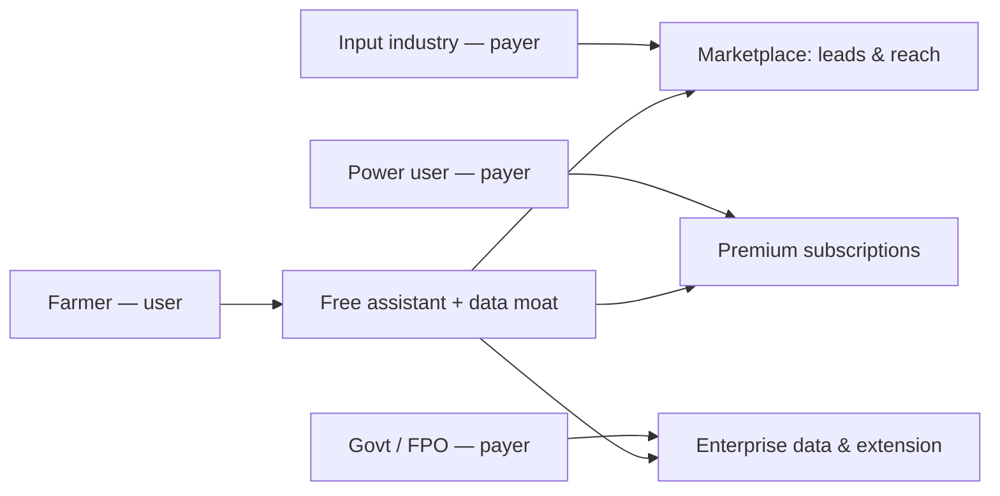

# 16 — Startup Plan

> **Metadata**
> - **Title:** 16 — Startup Plan
> - **Version:** 1.0
> - **Status:** `[ACTIVE]`
> - **Owner:** Founders / Investors
> - **Last Reviewed:** 2026-08-07
> - **Related Documents:** [01_Product_Vision](../product/01_Product_Vision.md) · [02_Product_Overview](../product/02_Product_Overview.md) · [03_Target_Users](../product/03_Target_Users.md) · [05_Product_Roadmap](../product/05_Product_Roadmap.md)

> **Why this document exists:** This is the investment and strategy narrative. It connects the product (docs 01-05) to a defensible business: who pays, what they pay for, how we reach users, who competes, and what our edge is. Honest about today's maturity (prototype, pre-revenue) and explicit about the path.

---

## 1. Executive summary

Vivasayi AI is a **Tamil-first, AI-powered agronomy assistant for Tamil Nadu's ~60 lakh farming families**, being built as a startup-ready product from a working prototype. The wedge: instant, personalized, bilingual (voice + image + text) farming advice grounded in a Tamil Nadu knowledge base — where today's alternatives are either slow/human-limited (helplines, extension officers) or English-first and generic (portals, ChatGPT).

The play is **depth first**: win Tamil Nadu district by district, crop by crop, then expand. Monetization follows trust: free assistant → premium intelligence (Phase 4) → marketplace and B2B data (Phases 3 & 5).

## 2. Business model

Two-sided with the farmer at the center:

- **Farmer side:** free (ads never intrude on answers). Farmers generate trust + structured farm data.
- **Money side:** three payers who value reach to and insight about that farmer base.

## 3. Revenue model

| Stream | Description | Timing | Margin |
|---|---|---|---|
| **Dealer leads / visibility** | Verified local dealers pay per lead / for visibility when a farmer's question matches their stock | Phase 3 | High |
| **Premium subscriptions** | CropDoctor Pro (unlimited image diagnosis + expert escalation), personal crop plan, priority model, farm records | Phase 4 | High |
| **Marketplace commission** | Input orders (and later produce) facilitated on-platform | Phase 4-5 | Med |
| **B2B analytics** | Aggregated, de-identified crop/pest/market intelligence for industry, FPOs, govt | Phase 5 | High |
| **Government / CSR** | Extension digitization pilots, scheme program integration | Phase 5 | Med-High |

## 4. Pricing (indicative)

| Tier | Price | Includes |
|---|---|---|
| **Free** | ₹0 | Daily chat quota (Flash), basic weather, text+voice, 10 image diagnoses/mo |
| **Pro** | ₹99-299/mo | Unlimited chat (Pro model), unlimited diagnoses, crop plan, alerts, expert escalation |
| **Dealer** | ₹1,000-5,000/mo | Verified profile, visibility, leads, order hand-off on WhatsApp |
| **Enterprise** | Custom | Dashboards, API, white-label, scheme integration, SLA |

> Pricing to be validated in Phase 3 pilot with willingness-to-pay tests (dealers first, then farmers).

## 5. Go-to-market

### Channel strategy
- **WhatsApp is home.** Farmers live on WhatsApp; the bot (Phase 2) is the primary acquisition surface. Voice notes + images = natural input.
- **Village-level trust:** "digikit" volunteers and TNAU/Agri-Dept student ambassadors run demo sessions in pilot districts.
- **Peer loop:** a saved crop is shared in farmer groups — the core viral mechanic.
- **Web app** remains the full-feature surface (records, plans, marketplace).

### Pilot sequencing
1. **Pilot district 1:** Thanjavur (delta paddy) — deep crop knowledge + seasonal calendar.
2. **Pilot district 2:** Coimbatore (horticulture) — image diagnosis for high-value crops.
3. **Pilot district 3:** Salem (vegetables/millets).
4. Expand only after retention + quality thresholds are met (see 05_Product_Roadmap).

## 6. Competitor analysis

| Competitor | What they are | vs Vivasayi AI |
|---|---|---|
| **Kisan Call Centre (KCC 1551) / TN agri extension** | State helpline + officers | Limited hours/reach; generic; not instant, not memory-based |
| **ChatGPT / Gemini (generic)** | General LLMs | Not Tamil-agronomy-grounded; risk of hallucinated prices/schemes; no TN district context |
| **Plantix / Crop Doctor apps** | Plant disease image diagnosis | Diagnostic only, no conversation, weak Tamil, no TN knowledge base |
| **DeHaat / AgroStar / Gramophone** | Agri marketplaces + advisory (north India-centric) | Broader scope, not TN-first, heavier app UX, less vernacular depth |
| **Fasal / crop-plan SaaS** | B2B agri-intelligence | Enterprise focus, not farmer-facing vernacular assistant |
| **TNAU portals / e-Krishi** | Institutional content | Static content; not conversational/personalized |

**Vivasayi's defensible position:** the **only Tamil-first conversational agronomy assistant grounded in TN-specific knowledge** with memory of the farmer's own farm, distributed on WhatsApp. Depth (district × crop × season) is the moat — not the LLM, which is commodity.

## 7. SWOT

### Strengths
- Real working prototype of the core loop (Tamil RAG chat).
- Strong, specific problem + underserved, massive user base.
- Modern stack (Gemini, RAG, serverless) → low marginal cost per conversation.
- Bilingual/voice-first design aligned to real usage patterns.

### Weaknesses
- **Security not production-ready** (see 15_Security) — blocks real users.
- Core claim (weather/location-aware AI) not yet delivered end-to-end.
- No WhatsApp presence; web-only today.
- Zero tests, monitoring, or cost analytics.
- Single founder; no team/ops.

### Opportunities
- WhatsApp-first vernacular agri-AI is an open lane in Tamil Nadu.
- Partnerships: TNAU content, input companies (CAC + credibility), FPOs (distribution).
- Government scheme digitization budgets.
- Data moat from consented farm profiles + records.

### Threats
- Big LLM platforms (Google/OpenAI) adding agri mode.
- Agri-marketplace incumbents adding advisory.
- Regulatory/data-privacy compliance burden (DPDP Act).
- Low willingness-to-pay in rural segment → reliance on B2B revenue.
- AI hallucination incident destroying trust (mitigate with grounding + eval).

## 8. Growth strategy

1. **Phase 1 (0→1):** harden security + deliver real context + image diagnosis; prove answer quality with the eval harness. Metric: quality thresholds, not users.
2. **Phase 2 (1→100):** WhatsApp bot + alerts + farm profiles → retention. Metric: W2 retention ≥40%, ≥5 questions/active user/week.
3. **Phase 3 (100→10k):** dealer marketplace revenue in 3 districts; referral loops. Metric: 10k MAU, first ₹1L/month.
4. **Phase 4 (10k→100k):** premium + expert loop + records. Metric: 3% paid conversion, ₹5L/month.
5. **Phase 5 (100k→1M+):** enterprise + govt + multi-state. Metric: ≥2 institutional contracts, 500k registered farmers.

## 9. Metrics that matter

- **Product:** W2 retention; ≥5 Q/active user/week; time-to-first-answer; answer quality (golden set ≥80%); cost/conversation.
- **Growth:** activation rate; referral/virality (shared-answer rate); MAU/WAU by district.
- **Business:** CAC, LTV (dealers + subscriptions), MRR, dealer lead volume, gross margin.

## 10. Ask (investor framing)

Phase 1 is an engineering sprint (security, context, diagnosis, testing) rather than growth spend. What we need before a round:
- A hardened, measurable product (Phase 1 completion).
- 1 pilot district with retention evidence (Phase 2 start).
- 1 revenue pilot (dealer leads) proving willingness to pay.

That sequence — security → quality → retention → revenue — is what the roadmap (05) and backlog (17) are built to deliver.
