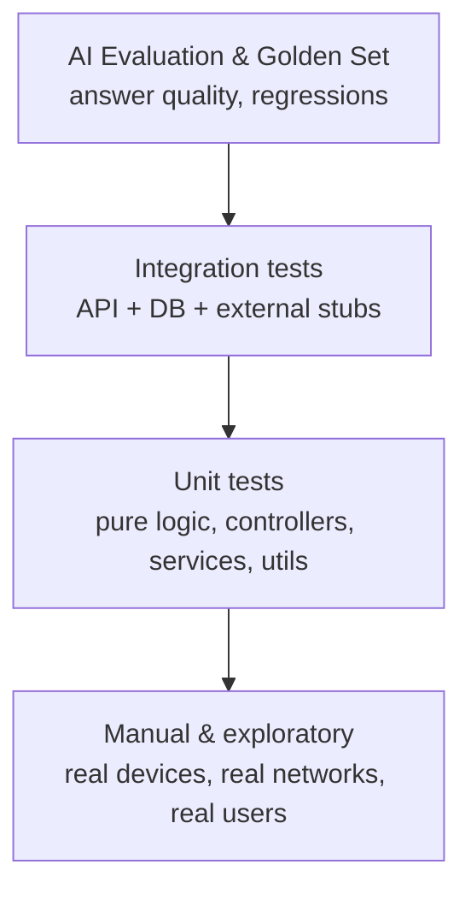
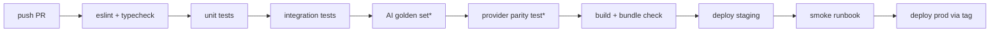

# 13 — Testing Strategy

> **Metadata**
> - **Title:** 13 — Testing Strategy
> - **Version:** 1.0
> - **Status:** `[ACTIVE]`
> - **Owner:** QA / Engineering
> - **Last Reviewed:** 2026-08-07
> - **Related Documents:** [10_User_Flows](../product/10_User_Flows.md) · [09_AI_Architecture](../architecture/09_AI_Architecture.md) · [12_Technical_Guidelines](12_Technical_Guidelines.md) · [14_Deployment](14_Deployment.md) · [15_Security](15_Security.md)

> **Why this document exists:** There are **zero automated tests** in this codebase today (`npm test` errors out), yet this product's credibility depends on answer accuracy and security. This document defines the test strategy across the stack — including how to test an AI system, which is unusual — so quality is built, not retrofitted.

---

## 1. Test pyramid (target)

Priority order for a startup: **AI eval + security/integration first** (they protect the core value), then unit coverage, then polish.

## 2. Unit testing

**Goal:** fast, deterministic verification of pure logic.

| Area | What to test | Tooling (planned) |
|---|---|---|
| Backend utils | `ApiError`, `ApiResponse`, `asyncHandler` (sanitized errors), env config validation | Vitest |
| Backend services | prompt assembly, context/weather merge, session title logic, message appending | Vitest |
| **Model Adapter** | contract tests per adapter (`ask`/`stream`/`vision`/`embed` return the contract shape); provider fakes; `MODEL_PROVIDER` selection; no service-layer vendor SDK imports (ADR-015, APP-05) | Vitest + fakes |
| **Context Engine** | per-domain resolvers (profile, GPS, weather, soil, season, history, advisories, RAG); missing-domain → `"unknown"` fallback; snapshot assembly + storage; zero-question guard (a UI-asked field must have no auto-resolver) (ADR-014, APP-02/03) | Vitest + mocks |
| **Farm Memory** | read/write memory entries; outcome capture; memory surfaced into context (ADR-016, APP-04) | Vitest |
| Frontend helpers | `farmerWeatherService` formatting (weather-code → text/icons, soil moisture thresholds, district matching, demo-mode logic), i18n key parity | Vitest |
| Frontend components | `MessageBubble` (timestamp, image/audio branches), `VoiceRecorder` (state), `ChatInterface` (state transitions with mocked `api.ts`) | Vitest + React Testing Library |

**Mocking rules:** mock network/DB/AI at their boundaries; never mock the thing under test. Keep tests free of real API keys.

## 3. Integration testing

**Goal:** prove the API contract end-to-end against a real (or in-memory) DB with external services stubbed.

- **Backend:** Vitest + Supertest against the Express app; `mongodb-memory-server` for Mongo; stub Cohere/ChromaDB/Gemini/Cognito with in-memory fakes or `nock`.
- **Cover at least:**
  - Auth: `/auth/google` success + failure; token verification (post-F-19).
  - Chat: new session, follow-up with context, missing fields, model failure fallback (RAG-off path), 500/400 handling.
  - Sessions CRUD: create/list/get/append/delete/clear; **cross-user isolation negative tests** (user B must not read/delete user A's sessions) — the key security test.
  - Context Engine (post-F-46): each domain resolves; a domain's upstream failure → `"unknown"` flag, answer still produced; snapshot persisted.
  - Model Adapter (post-F-45): request through `MODEL_PROVIDER=gemini` vs a fake provider yields identical service behavior (provider-parity test).
  - Weather proxy (post-F-20): caching, upstream failure fallback.
- **Frontend:** mock the API layer; test flows per [10_User_Flows.md](../product/10_User_Flows.md) mapping table.

## 4. AI testing (critical & unique)

The LLM is non-deterministic; test it with an **evaluation harness**, not assertions.

### 4.1 Golden evaluation set
- 50-100 curated (question, expected-answer-rubric) pairs across: pests/diseases, fertilizers, irrigation, crop selection, seasons, Tamil-only, English, Tanglish, follow-up-with-context, off-topic, unsafe.
- Each case scored by rubric dimensions:
  - **Groundedness** (does not invent facts/schemes/prices),
  - **Relevance** (answers the question),
  - **Actionability** (gives concrete steps),
  - **Language** (correct Tamil/English, no English jargon in Tamil mode),
  - **Safety** (defers to officer when uncertain; refuses out-of-scope),
  - **Context-awareness** (post-Context Engine: uses the assembled farm/weather/soil context when the rubric says it should — APP-03).
- Threshold (Phase 1): ≥80% acceptable across the set; **no** critical groundedness failures.
- **Provider parity:** each golden case is scored against every active Model Adapter; a provider swap must not regress the set (APP-05/12).

### 4.2 Eval workflow
1. Prompt/model change → run golden set (CI, nightly).
2. Regression detected → block merge (or document accepted regression + rationale in CHANGELOG).
3. Human-in-the-loop: flagged by thumbs-down + manual weekly review of a random sample.
4. Golden set grows from real missed queries (feedback loop into knowledge pipeline).

### 4.3 Cost/perf tests
- Assert p75 latency and estimated $/conversation stay under budget (alert on drift). This is a testable contract (see 14_Deployment, 15_Security).

## 5. Manual testing

- **Smoke runbook** (per release): login → language → chat (Tamil + English) → voice → image (once implemented) → weather → history → logout.
- **Device matrix:** 2 Android devices (low-end + mid), 1 iPhone, desktop Chrome; 3G/4G throttle; mobile data + Wi-Fi.
- **Language matrix:** Tamil-only user, Tanglish user, English user.
- Track manual checks as a checklist in the release PR (no separate tooling until scale demands it).

## 6. Regression testing

- CI: lint → typecheck → unit → integration on every PR.
- AI regression: golden set on every prompt/model change (nightly cron).
- Security regression: auth bypass + cross-user isolation tests run on every change to auth/session code.
- Manual smoke before every release to staging.

## 7. Performance testing

- **Chat latency:** p50/p95 from first token (streaming, Phase 1) and total response; budget: first token <2s, total <8s p75.
- **Cold start:** Lambda cold-start p95 <3s (or move to provisioned concurrency if violated).
- **DB:** session listing with 100/1000 sessions; message pagination (post-F-28).
- **Load:** 50 concurrent chat requests against staging with stubbed AI to test rate limits + queue behavior.
- **Client:** Lighthouse mobile score ≥80; bundle budget (Vite build size tracking).

## 8. Test data & environments

- Unit/integration: `mongodb-memory-server` + fakes. No live keys.
- Staging: full stack with **real but rate-limited** AI providers + real Mongo (sanitized).
- Production: never run tests against prod; use synthetic users in staging only.

## 9. CI pipeline (planned)

`*AI golden set` = nightly + on prompt/model/context changes; always on `main`. `*provider parity` = golden set scored on every active provider adapter.

## 10. Coverage targets (by Phase 1)

- Backend unit/integration: ≥60% lines on services/controllers/middleware; **100%** on auth middleware + session authorization.
- Frontend: ≥50% on services and critical components (ChatInterface, MessageBubble).
- AI golden set: 50+ cases, threshold ≥80% acceptable, 0 critical groundedness failures.
- Security negatives: auth bypass, cross-user read/delete/clear — must pass 100%.
