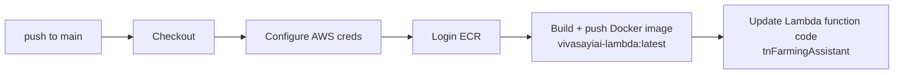
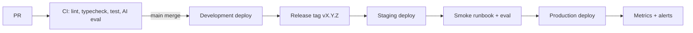

# 14 — Deployment

> **Metadata**
> - **Title:** 14 — Deployment
> - **Version:** 1.0
> - **Status:** `[ACTIVE]`
> - **Owner:** DevOps / Backend
> - **Last Reviewed:** 2026-08-07
> - **Related Documents:** [06_System_Architecture](../architecture/06_System_Architecture.md) · [12_Technical_Guidelines](12_Technical_Guidelines.md) · [15_Security](15_Security.md) · [18_DECISIONS](../decisions/18_DECISIONS.md)

> **Why this document exists:** Anyone on the team must be able to run the stack locally and understand how code reaches production. This documents local setup, environments, environment variables, the current CI/CD, and the target flow.

---

## 1. Local development

### Prerequisites
- Node.js 20+ (backend Dockerfile uses Node 24 Lambda base; local Node 20+ is fine for dev)
- MongoDB: local instance **or** Atlas connection string
- API keys for Gemini, Cohere, ChromaDB Cloud (for chat); AWS keys + S3 bucket (for ingestion)

### Backend (`tn-farming-assistant`)
```bash
cd tn-farming-assistant
npm install
# create .env (see §4) — copy values from your environment
npm run dev        # nodemon on http://localhost:8000
```
- Scripts: `start` (`node index.js`), `dev` (`nodemon index.js`), `test` (currently a stub — see 13_Testing_Strategy).
- The app connects to MongoDB at startup (`await connectDB()` in `index.js`) and initializes the ChromaDB collection + Gemini/Cohere clients at module load.

### Frontend (`tn-farming-assistant-frontend`)
```bash
cd tn-farming-assistant-frontend
npm install
# create .env (see §4)
npm run dev        # Vite on http://localhost:5173
npm run build      # production build
npm run typecheck  # tsc --noEmit
npm run lint       # eslint
```

### Run both
Backend on `:8000`, frontend on `:5173`; frontend `.env` `VITE_API_URL=http://localhost:8000`. Cognito redirect URI must include `http://localhost:5173`.

> **Gotcha (today):** the frontend calls Open-Meteo directly (browser), so weather works without backend. Chat requires a fully configured backend (Gemini + Cohere + ChromaDB + Mongo).

---

## 2. Environments

| Environment | Backend | Frontend | Purpose |
|---|---|---|---|
| **Local** | localhost:8000 | localhost:5173 | development |
| **Development** | (planned) auto-deployed from `main` | (planned) preview build | integration |
| **Staging** | (planned) from release candidate | (planned) | QA + AI eval |
| **Production** | AWS Lambda `tnFarmingAssistant` | not yet deployed | live users |

> **Current reality:** only *local* and *production* (Lambda) exist. The CI deploys `main` directly to the Lambda. Staging and gated production deploys are Phase 1 infrastructure work.

---

## 3. Current CI/CD

### Backend — `.github/workflows/deploy-lambda.yml`
Trigger: push to `main`.



- Dockerfile: `public.ecr.aws/lambda/nodejs:24`, `npm install --production --legacy-peer-deps`, `CMD ["index.handler"]`.
- Lambda entry: `export const handler = serverless(app)` (`index.js`).

### Frontend
- No CI/CD configured (no deploy target yet). Add Vercel/Netlify/CloudFront pipeline in Phase 1.

---

## 4. Environment variables

### Backend `.env` (local; ignored by git — do not commit)
| Variable | Purpose | Required |
|---|---|---|
| `PORT` | local port (8000) | dev |
| `MONGO_URI` | MongoDB Atlas connection string | yes |
| `COGNITO_CLIENT_ID` | Cognito OAuth2 client | yes |
| `COGNITO_CLIENT_SECRET` | client secret (empty if none) | app-specific |
| `COGNITO_DOMAIN` | Cognito domain for token exchange | yes |
| `COGNITO_REDIRECT_URI` | must match frontend callback (e.g., `http://localhost:5173`) | yes |
| `GOOGLE_API_KEY` | Gemini API key (backend chat) | yes* |
| `MODEL_PROVIDER` | **Model Adapter provider: `gemini` today; future `llama`/`qwen`/`mistral`/`selfhosted` (F-45)** | yes |
| `MODEL_NAME` | model id for the active provider (e.g., `gemini-2.5-flash`) | yes |
| `MY_AWS_REGION` | S3 ingestion region | ingestion |
| `MY_AWS_ACCESS_KEY_ID` | S3 access | ingestion |
| `MY_AWS_SECRET_ACCESS_KEY` | S3 secret | ingestion |
| `S3_BUCKET` | dataset bucket | ingestion |
| `COHERE_API_KEY` | embeddings (chat + ingestion) | yes |
| `CHROMA_API_KEY` | ChromaDB cloud | yes |
| `CHROMA_TENANT` | ChromaDB tenant | yes |
| `CHROMA_DATABASE` | ChromaDB database | yes |

*Required by the `gemini` adapter; each adapter declares its own key (`LLAMA_API_KEY`, `OPENAI_BASE_URL`, etc.) and is validated by the config module (12_Technical_Guidelines §2b).

### Frontend `.env`
| Variable | Purpose |
|---|---|
| `VITE_API_URL` | backend base URL (`http://localhost:8000`) |
| `VITE_COGNITO_DOMAIN` | Cognito OAuth2 domain |
| `VITE_COGNITO_CLIENT_ID` | Cognito client |
| `VITE_COGNITO_REDIRECT_URI` | `http://localhost:5173` |

### Actions required (Phase 1)
1. Commit **`.env.example`** for both repos (with placeholder values, no secrets), including `MODEL_PROVIDER`/`MODEL_NAME`.
2. Move backend secrets to **AWS Secrets Manager / SSM Parameter Store**; Lambda reads at runtime. GitHub Actions uses repo secrets (already does for AWS). Per-provider keys live in the secret manager, referenced by the Model Adapter config.
3. Remove the need for ingestion keys at chat runtime (chat only needs Gemini/Cohere/Chroma/Mongo).
4. **Rotate all existing keys** — they exist in plaintext on developer machines (see 15_Security §4).

---

## 5. Target deployment flow (Phase 1)



### Backend target
- Build ECR image tagged with commit SHA + `latest`; Lambda versioned aliases (`dev`, `staging`, `prod`); `update-alias` instead of overwriting the live function.
- Provisioned concurrency or on-demand tuning after cold-start measurement.

### Frontend target
- Vercel/Netlify: preview per PR, `main` → dev, tag → staging, `main` stable → prod. Static asset CDN + caching.

---

## 6. Operational runbook (once live)

| Event | Action |
|---|---|
| Chat errors spike | Check Sentry + CloudWatch; verify Gemini/Chroma/Cohere status; check rate-limit + cost dashboard |
| Latency spike | Cold starts (provisioned concurrency), DB index usage, retrieval latency, LLM latency |
| Cost spike | Per-conversation dashboard; verify quotas/caching; throttle free tier |
| Model provider outage | Failover to fallback model or graceful degradation (chat-context-only mode exists) |
| Credential rotation | Rotate in secret manager, restart Lambda, update `.env.example`, log in DECISIONS |

## 7. Release checklist (before prod deploy)

- [ ] CI green (lint, typecheck, unit, integration).
- [ ] AI golden set ≥ threshold; no critical groundedness regressions.
- [ ] Smoke runbook passed on staging (see 13_Testing_Strategy §5).
- [ ] Security negatives passed (auth + cross-user isolation).
- [ ] Env vars/secrets in place for target environment.
- [ ] CHANGELOG updated (19).
- [ ] Rollback plan defined (previous image tag).
