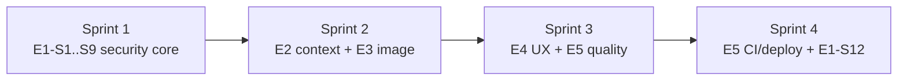

# 17 — Backlog

> **Metadata**
> - **Title:** 17 — Backlog
> - **Version:** 1.0
> - **Status:** `[ACTIVE]`
> - **Owner:** Product Manager / Engineering
> - **Last Reviewed:** 2026-08-07
> - **Related Documents:** [04_Feature_List](../product/04_Feature_List.md) · [05_Product_Roadmap](../product/05_Product_Roadmap.md) · [18_DECISIONS](../decisions/18_DECISIONS.md) · [19_CHANGELOG](19_CHANGELOG.md)

> **Why this document exists:** The working backlog for PM and engineering. It organizes work into epics → features → stories → tasks with priority, estimate, dependencies, and status. It is the execution counterpart to the roadmap (05) and feature list (04). IDs are stable so tickets/commits can reference them.

**Legend:** Priority `P0/P1/P2/P3` · Estimate in story points (S≈1, M≈3, L≈5, XL≈8) · Status `[TODO] [IN PROGRESS] [DONE] [BLOCKED]`

> **Historical note:** the original capstone plan lives at `docs/planning/todo.md`; this backlog supersedes it.

---

## EPIC 1 — Foundation & Security (Phase 1, P0)

| ID | Feature | Story / Task | Pri | Est | Dep | Status |
|---|---|---|---|---|---|---|
| E1-S1 | Remove insecure demo endpoints | Remove `/test/*` routes + `test.controller.js` + dead `Query`/`Context` CRUD | P0 | 1 | — | DONE (E1-S1) |
| E1-S2 | Verified authentication | Verify Cognito ID token (signature, issuer, audience, expiry) server-side; replace `jwt.decode` | P0 | 3 | E1-S1 | DONE (E1-S2) |
| E1-S3 | Session JWT issuance | Backend issues short-lived session JWT (+ refresh); stable `cognitoSub` identity; `User.cognitoSub` field | P0 | 5 | E1-S2 | DONE (E1-S3) |
| E1-S4 | `requireAuth` middleware | All routes (except auth/health) require `Bearer` token; identity from token only | P0 | 3 | E1-S3 | DONE (E1-S4) |
| E1-S5 | Ownership scoping | All session queries scoped by authenticated user; 404 for foreign resources | P0 | 3 | E1-S4 | DONE (E1-S5) |
| E1-S6 | Error sanitization | `asyncHandler` returns generic errors; no stack/cause to clients | P0 | 2 | E1-S4 | DONE (E1-S6) |
| E1-S7 | CORS + body limits | Restrict CORS origin; `express.json({limit})` | P0 | 1 | — | DONE (E1-S7) |
| E1-S8 | Rate limiting | Auth + chat + session mutation rate limits; `429` responses | P0 | 3 | E1-S4 | DONE (E1-S8) |
| E1-S9 | Input validation | zod/express-validator for body/query; message length cap | P0 | 3 | — | DONE (E1-S9) |
| E1-S10 | Secrets rotation & `.env.example` | Rotate all keys; add `.env.example` both repos; move to Secrets Manager | P0 | 3 | — | TODO |
| E1-S11 | Secret scanning CI | gitleaks in GitHub Actions | P0 | 1 | E1-S10 | TODO |
| E1-S12 | Frontend token handling | Move from localStorage id_token to in-memory/httpOnly + refresh flow | P0 | 5 | E1-S3 | TODO |

## EPIC 2 — Real AI Context (Phase 1, P0)

| ID | Feature | Story / Task | Pri | Est | Dep | Status |
|---|---|---|---|---|---|---|
| E2-S1 | Weather proxy endpoint | Backend fetches + caches district weather (Open-Meteo, 30-min TTL) | P0 | 3 | E1-S4 | DONE (E2-S1) |
| E2-S2 | Soil/crop reference data | Seed 37 TN districts (lat/lon/region from frontend config) → DB (`districts` collection) | P0 | 3 | — | DONE (E2-S2) — seed via `node scripts/seedDistricts.js` at deploy; soil/crops per district backfilled later by D-19 (not fabricated) |
| E2-S3 | Context assembly layer | Merge weather + soil + farm profile + RAG into prompt; remove dead `{{...}}` placeholders | P0 | 5 | E2-S1, E2-S2 | DONE (E2-S3) |
| E2-S4 | Farm profile MVP | Onboarding: district, crops, acres → `profiles` collection; used by context assembly | P0 | 5 | E2-S3 | DONE (E2-S4) |
| E2-S5 | RAG metadata filters | ChromaDB filter by district/crop/season at query time | P1 | 5 | E2-S3 | DEFERRED — blocked on D-28 (curated content store with tags; none in current ingestion) |

## EPIC 3 — Image Diagnosis (Phase 1, P0)

| ID | Feature | Story / Task | Pri | Est | Dep | Status |
|---|---|---|---|---|---|---|
| E3-S1 | Upload endpoint | Multipart `/upload`; normalize → private S3 → metadata record | P0 | 5 | E1-S4 | DONE (E3-S1 + E3-S2 storage half) |
| E3-S2 | Vision analysis | Downscale → Gemini Vision → structured diagnosis (cause/treatment/escalation) | P0 | 5 | E3-S1 | DONE (E3-S2 backend) — `POST /chat` with `uploadId`; t214/t215 green |
| E3-S3 | Frontend send pipeline | Send selected image with message; progress + error states | P0 | 3 | E3-S1 | TODO (frontend story) |
| E3-S4 | Diagnosis card UI | Render structured diagnosis, not prose | P0 | 3 | E3-S2 | TODO (frontend story) |

## EPIC 4 — Chat & UX (Phase 1, P0)

| ID | Feature | Story / Task | Pri | Est | Dep | Status |
|---|---|---|---|---|---|---|
| E4-S1 | Streaming (SSE) | Token streaming; first token <2s | P0 | 5 | — | BLOCKED — production path cannot serve SSE today (see note below) |
| E4-S2 | Typed API client | Replace raw `fetch`; shared types from OpenAPI | P0 | 3 | — | TODO |
| E4-S3 | Session API consolidation | Single sessions resource; retire `/chat/session|sessions` duplicates | P0 | 3 | E1-S4 | DONE (E4-S3) — duplicates removed 2026-09-11 |
| E4-S4 | Message pagination | Normalize messages; paginated list + stable `_id` | P1 | 5 | E1-S4 | TODO |
| E4-S5 | Tamil-first onboarding | Language before login; district chips; suggested questions | P0 | 5 | E2-S4 | TODO |
| E4-S6 | Accessibility pass | `aria-label`s, focus, reduced-motion, keyboard (Esc) | P1 | 3 | — | TODO |

> **E4-S1 blocker (2026-09-11):** the deployment path is a **Lambda via `serverless-http`** (`index.js` exports the handler only; local `app.listen` is commented out). `serverless-http` buffers the entire response, so SSE cannot pass through; Lambda response streaming requires a `streamifyResponse` handler + `INVOKE_MODE=RESPONSE_STREAM` (function URL/API Gateway) — infra that does not exist in this repo, plus an approved SSE transport decision (D-05, P1-HARD, still PENDING). Implementing `ChatGoogleGenerativeAI.stream()` without that infra yields code that cannot run in production, and a polling fallback would be inventing an architecture. **Revisit after D-05 approval + a streaming-capable deploy path.**

## EPIC 5 — Quality & Observability (Phase 1, P0)

| ID | Feature | Story / Task | Pri | Est | Dep | Status |
|---|---|---|---|---|---|---|
| E5-S1 | Backend test suite | Vitest + Supertest + mongodb-memory-server; auth + isolation negatives | P0 | 5 | E1-S4 | TODO |
| E5-S2 | Frontend tests | Vitest + RTL for services/components | P1 | 5 | — | TODO |
| E5-S3 | AI golden set | 50+ curated Tamil/English cases + scoring rubric | P0 | 8 | — | TODO |
| E5-S4 | CI pipeline | lint → typecheck → unit → integration → AI eval → build | P0 | 5 | E5-S1..3 | TODO |
| E5-S5 | Monitoring | Structured logs (pino), Sentry, $/conversation + latency dashboards | P1 | 5 | — | TODO |
| E5-S6 | Staging env + gated deploys | No direct-to-prod on push; tag → staging → prod | P0 | 5 | E5-S4 | TODO |

## EPIC 6 — WhatsApp (Phase 2, P1)

| ID | Feature | Story / Task | Pri | Est | Dep | Status |
|---|---|---|---|---|---|---|
| E6-S1 | WhatsApp text bot | WhatsApp Business API webhook; session per phone | P1 | 8 | E2-S3 | TODO |
| E6-S2 | Voice-note input | Audio → STT → chat pipeline | P1 | 5 | E6-S1 | TODO |
| E6-S3 | Tamil TTS output | Google Cloud TTS; `audioUrl` on messages; auto-play toggle | P1 | 5 | E4-S1 | TODO |
| E6-S4 | Alerts engine | Weather/price/pest push alerts | P1 | 8 | E6-S1 | TODO |

## EPIC 7 — Monetization (Phase 3-4, P1-P2)

| ID | Feature | Story / Task | Pri | Est | Dep | Status |
|---|---|---|---|---|---|---|
| E7-S1 | Dealer directory | Verified dealer profiles + location/stock matching | P1 | 8 | E6-S1 | TODO |
| E7-S2 | Lead delivery | Pay-per-lead flow on WhatsApp; tracking | P1 | 5 | E7-S1 | TODO |
| E7-S3 | Payments | UPI/card subscriptions; billing engine | P2 | 8 | E4-S1 | TODO |
| E7-S4 | CropDoctor Pro | Premium tier: unlimited diagnoses + expert escalation queue | P2 | 8 | E3-S2, E7-S3 | TODO |
| E7-S5 | Farm recordkeeping | Digital diary + reports | P2 | 8 | E2-S4 | TODO |

## EPIC 8 — Scale (Phase 5, P2-P3)

| ID | Feature | Story / Task | Pri | Est | Dep | Status |
|---|---|---|---|---|---|---|
| E8-S1 | B2B analytics dashboards | Aggregated de-identified intelligence; consent framework | P2 | 8 | E5-S5 | TODO |
| E8-S2 | Scheme matching | Government scheme eligibility + sourced data | P2 | 8 | E2-S4 | TODO |
| E8-S3 | Knowledge packs | Multi-state expansion runbook | P3 | 8 | E8-S1 | TODO |

### Vision-v2 platform features (F-45…F-48) — tracked at feature level

The Decision Platform pillars — **Model Adapter (F-45)**, **full Context Engine (F-46)**, **Farm Memory (F-47)**, and **Government Advisory ingestion (F-48)** — are tracked at **feature level** in [04_Feature_List.md §3b](../product/04_Feature_List.md) with their statuses, priorities, and dependencies (bound by [PRODUCT_PRINCIPLES](../product/PRODUCT_PRINCIPLES.md) PP-03/05/07 and ADR-014/015/016). Their detailed stories are added to this backlog when their phase begins: **F-45 and the Context Engine first slice (F-20)** start in Phase 1; **full F-46, F-47, F-48** start in Phase 2 (see [05_Product_Roadmap](../product/05_Product_Roadmap.md)). This note does not change any priority or sprint plan in this document.

---

## Priority order (next 4 sprints)

## Backlog hygiene rules

1. Only **one** `IN PROGRESS` per engineer; WIP limit per sprint.
2. Story complete = code + tests + docs updated (API doc, CHANGELOG) + review.
3. Feature statuses in [04_Feature_List.md](../product/04_Feature_List.md) must match this backlog.
4. New stories reference the feature ID (e.g., `F-22`).
5. Estimates are relative and reviewed each planning session.
