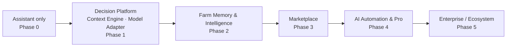

# 02 — Product Overview

> **Metadata**
> - **Title:** 02 — Product Overview
> - **Version:** 1.0
> - **Status:** `[ACTIVE]`
> - **Owner:** Product / Founding team
> - **Last Reviewed:** 2026-08-07
> - **Related Documents:** [01_Product_Vision](01_Product_Vision.md) · [03_Target_Users](03_Target_Users.md) · [04_Feature_List](04_Feature_List.md) · [05_Product_Roadmap](05_Product_Roadmap.md) · [AI_Product_Principles](AI_Product_Principles.md)

> **Why this document exists:** A one-page-plus overview that orients anyone — investor, partner, or new hire — on what Vivasayi AI is, who it serves, and how far along it is. It intentionally separates **today's reality** from **aspiration** so no one mistakes the demo for the product, or the vision for the status quo.

---

## 1. What is Vivasayi AI?

Vivasayi AI ("Vivasayi" = farmer in Tamil) is a **bilingual (Tamil + English) AI Agriculture Decision Platform for Tamil Nadu agriculture** — **not a chatbot** (see [AI_Product_Principles.md](AI_Product_Principles.md), APP-01). It takes farmers' questions about crops, pests, fertilizers, irrigation, soil, and seasonal planning — in their own language, via text, voice, and (in the UI today) image capture — and returns **decision-support outcomes**: grounded recommendations, structured diagnoses, and actionable plans.

It is built as a **retrieval-augmented generation (RAG) system**: a large language model (Gemini 2.5 Flash) is grounded with a curated Tamil Nadu agricultural knowledge base (currently CSV datasets stored in AWS S3 and indexed in ChromaDB) plus conversation memory, so answers are local and context-aware rather than generic.

**Vision v2 direction (planned, not yet built):** three architectural pillars turn the conversational core into a decision platform —

- **Context Engine** — automatically assembles Farm Profile, Farm Location, GPS, Weather, Soil Type, Season, Crop History, Government Advisories, and Agricultural Knowledge *before* the LLM is invoked, so the farmer is never re-asked for what the platform can already know (APP-02/03).
- **Model Adapter** — provider-agnostic AI layer; Gemini is the current provider and can be replaced by Llama, Qwen, Mistral, or our own model by configuration (APP-05).
- **Farm Memory** — persistent long-term memory of the farm across sessions, seasons, and channels (APP-04).

**Two software artifacts make up the product:**

| Artifact | Description | Status |
|---|---|---|
| Backend API (`tn-farming-assistant`) | Express API on AWS Lambda — auth, chat with RAG, chat-session management, knowledge ingestion | [EXISTING] |
| Web frontend (`tn-farming-assistant-frontend`) | React SPA — login, weather card, bilingual chat UI, voice input, chat history | [EXISTING] |

## 2. Why was it built?

Tamil Nadu's farmers face a chronic gap between the questions they have and the answers they can reach:

- Extension officers and the state helpline (Kisan Call Centre) are limited in reach and hours.
- Online resources are largely English-first and generic — useless to a Tamil-only speaker.
- A farmer's question is **urgent and context-specific** ("my tomato leaves are yellowing in Coimbatore in this humidity"), and no existing channel answers it instantly with local context.

Vivasayi AI was built as a capstone thesis that this gap is solvable with modern LLMs + retrieval + mobile-first UX: **instant, personalized, vernacular agricultural advice**. The product exists today as a working prototype that proves the core loop — ask a question in Tamil, get a grounded, context-aware answer — and it is being hardened into a startup-ready product.

## 3. Who is it for?

- **Primary end user:** the Tamil-speaking small/marginal farmer — 2-5 acres, smartphone owner, low English literacy, WhatsApp-native, not app-store-native.
- **Secondary end users:** extension officers, FPO staff, students, and agronomy-curious users who need fast, sourced agronomy answers.
- **Economic customers (future payers):** agri-input companies, FPOs, government agri-extension, and premium commercial farmers — who value reach to and insight about this farmer base.

See [03_Target_Users.md](03_Target_Users.md) for detailed personas.

## 4. What problems does it solve?

| Problem | How Vivasayi AI addresses it |
|---|---|---|
| No on-demand expert advice for farmers | 24/7 decision platform; ask any time, get an actionable answer in seconds |
| Language barrier (English-first content) | Full Tamil interface + Tamil-first AI responses |
| Literacy/typing barriers | Voice input (browser speech-to-text) and image capture in the UI |
| Generic, one-size-fits-all advice | RAG-grounded knowledge base + automatic Context Engine (farm profile, GPS, weather, soil, season, history) |
| No persistent farm context | Farm Memory — the platform remembers the farm across sessions, seasons, and channels |
| Farmers forced to repeat themselves | Zero-question principle: context is auto-obtained, never re-asked (APP-02) |
| Hard-to-navigate agricultural content | A single chat surface instead of a government portal |

## 5. Why AI?

- **Scale:** no call-center or officer network can answer every farmer instantly; an LLM can.
- **Language:** LLMs are the only practical way to produce natural, accurate Tamil agronomy advice at scale (the prompt system is built around Tamil-first output).
- **Grounded knowledge:** RAG lets the AI cite and stay within a curated TN knowledge base, addressing the "hallucinating chatbot" risk that would destroy farmer trust.
- **Multi-modal:** images and voice are the natural farmer interface, and modern AI models can ingest both.
- **Decisions, not chat:** the model is a reasoning layer that fuses retrieved knowledge with automatically assembled farm context to produce decisions — and a Model Adapter keeps that reasoning layer provider-agnostic.

> **Honest caveat — what AI does NOT do today:** weather/soil/location data is collected in the frontend but is **not yet injected** into the AI prompt (see [09_AI_Architecture.md](../architecture/09_AI_Architecture.md)); images can be selected in the UI but are **not yet sent** to the backend for analysis; there is **no Context Engine, Model Adapter, or Farm Memory yet** — the platform architecture above is the vision-v2 target. All of it is on the roadmap.

## 6. Current maturity

### 6.1 Working today `[EXISTING]`
- Google sign-in via AWS Cognito (OAuth2 code flow).
- Bilingual chat with RAG over the TN knowledge base (Gemini 2.5 Flash + Cohere embeddings + ChromaDB).
- Conversation memory within a chat session (last 6 messages).
- Chat session creation, listing, deletion, clearing (persisted in MongoDB).
- Voice-to-text input using the browser's Web Speech API.
- Weather widget on the login screen (Open-Meteo, auto geo-location, nearest of 38 TN districts), with farmer-friendly advice cards and 7-day forecast.
- Language selection (English/Tamil) persisted locally.
- Backend deployed to AWS Lambda via Docker → ECR with a GitHub Actions pipeline.

### 6.2 Present in UI but not wired end-to-end
- Image upload: selectable and previewed; backend accepts authenticated multipart upload (E3-S1 transport); S3 storage is E3-S2 (D-23 pending).
- Audio playback of answers: a UI affordance exists, but no text-to-speech is implemented.
- Chat session APIs: two parallel route families exist (`/chat/*` and `/chatsessions/*`) with overlapping behavior.

### 6.3 Missing for production (see 04_Feature_List / 17_Backlog)
- Verified/authorized API access (auth is email-claim-based today).
- Rate limiting, input validation hardening, secret rotation.
- **Context Engine:** real weather/location/soil/farm-profile context auto-assembled and injected into AI prompts (first slice F-20; full platform F-46).
- **Model Adapter:** provider-agnostic AI layer (F-45).
- **Farm Memory:** long-term farm intelligence across sessions (F-47).
- **AI diagnosis pipeline:** image + context-fused diagnosis (F-22).
- Streaming responses.
- Automated tests and AI evaluation harness.
- Monitoring of cost, latency, and answer quality.

## 7. Future direction

- **Phase 1 — Trusted decision core:** hardened auth/security, **Context Engine first slice** (weather/location/soil/farm profile), **Model Adapter**, **AI diagnosis pipeline**, streaming, tests + monitoring. *(This is the immediate engineering focus.)*
- **Phase 2 — Farm Memory & intelligence:** full Context Engine domains (crop history, government advisories), long-term Farm Memory, personal crop plans, weather/price/pest alerts, WhatsApp bot, Tamil text-to-speech.
- **Phase 3 — Marketplace:** local dealer directory, product matching from conversations, mandi price feeds.
- **Phase 4 — AI automation & Pro:** CropDoctor Pro, expert escalation, premium subscriptions, farm recordkeeping.
- **Phase 5 — Enterprise:** B2B analytics, government scheme matching, multi-state knowledge packs.

Detailed phases and success metrics: [05_Product_Roadmap.md](05_Product_Roadmap.md).

## 8. At a glance

| Dimension | Today | Target (Phase 1) |
|---|---|---|
| Language | Tamil + English | Tamil-first, English secondary |
| Channels | Web app | Web + WhatsApp |
| Inputs | Text + voice + (image UI) | Text + voice + image analysis |
| Positioning | Conversational assistant | **AI Agriculture Decision Platform** |
| Context | Conversation memory | **Context Engine**: farm profile + GPS + weather + soil + season (auto-assembled) |
| Memory | Session-only | Session + **Farm Memory** (long-term) |
| AI provider | Gemini (direct) | **Model Adapter** — Gemini now, providers swappable |
| Answers | Non-streaming (5-15s) | Streaming (<2s first token) |
| Security | Email-claim auth | Verified tokens, per-user authorization |
| Testing | None | Unit + integration + AI eval harness |
| Analytics | None | Cost, latency, retention, answer quality |
