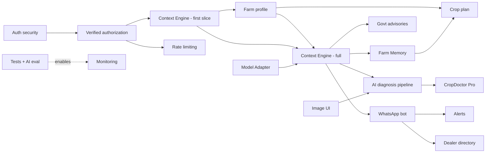

# 04 — Feature List

> **Metadata**
> - **Title:** 04 — Feature List
> - **Version:** 1.0
> - **Status:** `[ACTIVE]`
> - **Owner:** Product Manager / Engineering
> - **Last Reviewed:** 2026-08-07
> - **Related Documents:** [05_Product_Roadmap](05_Product_Roadmap.md) · [17_Backlog](../planning/17_Backlog.md) · [18_DECISIONS](../decisions/18_DECISIONS.md) · [AI_Product_Principles](AI_Product_Principles.md) · [PRODUCT_PRINCIPLES](PRODUCT_PRINCIPLES.md)

> **Why this document exists:** A single, authoritative inventory of every feature with its status, value, complexity, priority, and dependencies. It stops "it's kind of working" ambiguity and gives PM/engineering a shared vocabulary. Status labels: `[EXISTING]` · `[PLANNED]` · `[FUTURE]` · `[REJECTED]`. `[IN PROGRESS]` is used where partial implementation exists.

**Legend for ratings:**
- **BV** — Business Value (H/M/L) · **CX** — Technical Complexity (S/M/L/XL) · **Priority** — P0 (must), P1 (should), P2 (could), P3 (won't now)

---

## 1. Completed `[EXISTING]`

| # | Feature | Description | BV | CX | Priority | Dependencies |
|---|---|---|---|---|---|---|
| F-01 | **Bilingual chat (Tamil/English)** | Conversational AI answers grounded in the TN knowledge base; responds in the language of the question; Tamil-first prompt system | H | M | P0 | Gemini API, RAG |
| F-02 | **RAG knowledge retrieval** | User question → Cohere embeddings → top-3 ChromaDB chunks → injected as context into the LLM prompt | H | M | P0 | ChromaDB cloud, S3 datasets, ingestion |
| F-03 | **Conversation memory** | Last 6 messages of a session are included in the prompt; follow-ups reference earlier context | H | M | P0 | ChatSession model |
| F-04 | **Chat session persistence** | Sessions (title + messages) stored in MongoDB; create, list, fetch, delete, clear | H | S | P0 | MongoDB, ChatSession model |
| F-05 | **Google sign-in (Cognito)** | OAuth2 authorization-code login via AWS Cognito; user created/updated in MongoDB | H | M | P0 | Cognito, User model |
| F-06 | **Language selection & persistence** | English/Tamil picker after login; choice persisted in localStorage | H | S | P0 | Frontend state |
| F-07 | **Voice input (speech-to-text)** | Browser Web Speech API transcription into the chat input (English + Tamil, browser-dependent) | H | S | P0 | Browser support |
| F-08 | **Weather card (login screen)** | Geo-location → nearest of 38 TN districts → Open-Meteo current + 7-day forecast → farmer-friendly advice; demo mode outside TN | M | M | P1 | Open-Meteo, district geo config |
| F-09 | **Chat sidebar & history** | Desktop sidebar / mobile drawer listing user sessions; new chat, delete, clear all | M | M | P0 | F-04 |
| F-10 | **Responsive UI** | Mobile-first layout for chat, sidebar, login, language screens | H | S | P0 | — |
| F-11 | **Bilingual UI strings (i18n)** | Hand-rolled en/ta translation dictionary covering core screens | M | S | P1 | — |
| F-12 | **Knowledge ingestion pipeline** | Script: lists S3 objects → CSV → split (1000/200 chunks) → Cohere embeddings → ChromaDB `farming-documents` collection | M | M | P0 | AWS S3, Cohere, ChromaDB |
| F-13 | **Serverless deployment** | Backend containerized (Docker) and deployed to AWS Lambda via ECR; GitHub Actions workflow | H | M | P0 | AWS, GitHub |
| F-14 | **Notification toasts** | Sonner toasts for create/delete/clear chat and errors | L | S | P2 | — |

## 2. In Progress `[IN PROGRESS]` (present but incomplete)

| # | Feature | What exists | What is missing | BV | CX | Priority | Dependencies |
|---|---|---|---|---|---|---|---|
| F-15 | **Image capture/upload (UI)** | File picker + preview bubble (ChatGPT-style) in the chat input | Image is **never sent** to the backend; no vision analysis; no storage | H | M | P0 | Vision model, upload/storage endpoint |
| F-16 | **Audio playback affordance** | `playAudio` button on AI bubbles if `audioUrl` exists | No text-to-speech; `audioUrl` is never populated | M | M | P1 | TTS service (e.g., Google Cloud TTS) |
| F-17 | **Auth security** | Cognito login works; backend decodes the ID token | Token signature/audience/expiry not verified; all APIs trust `userEmail` supplied by the client | H | M | P0 | Auth refactor (see 15_Security) |
| F-18 | **Session API** | Two route families exist (`/chat/session|sessions` and `/chatsessions/*`) with overlapping behavior | Duplication, drift risk, inconsistent payloads | M | S | P1 | Backend cleanup |

## 3. Planned `[PLANNED]` (next milestones)

| # | Feature | Description | BV | CX | Priority | Dependencies |
|---|---|---|---|---|---|---|
| F-19 | **Verified API authorization** | JWT verification (signature, issuer, audience, expiry) + `requireAuth` middleware; user identity derived from the token, never from body/query | H | M | P0 | F-17 |
| F-20 | **Context Engine — first slice (weather/location/soil)** | Backend fetches/caches district weather + soil + farm location and injects into the prompt via the Context Engine; removes dead placeholders (`{{district_name}}` etc.); foundation of APP-03 | H | M | P0 | F-19, weather proxy, soil data |
| F-21 | **Farm profile** | District, crops, acres, primary issue captured at onboarding; source for Context Engine + seed of Farm Memory | H | M | P0 | F-20 |
| F-22 | **AI diagnosis pipeline (image + context fusion)** | Upload → vision analysis **fused with Context Engine signals (weather, soil, crop, location)** → structured diagnosis card (cause → treatment → safety → escalation). Image is never analyzed in isolation (APP-07) | H | L | P0 | F-15, F-46, vision pipeline |
| F-23 | **Streaming responses (SSE)** | Token streaming so first text appears <2s; better perceived performance | M | M | P0 | Chat refactor |
| F-24 | **Rate limiting & input caps** | Throttle auth/chat; cap message length; protect AI costs | H | S | P0 | F-19 |
| F-26 | **Automated tests + AI eval harness** | Unit/integration tests (Vitest+Supertest); golden Tamil/English question set for answer quality | H | L | P0 | — |
| F-27 | **Monitoring & cost analytics** | Structured logs, error tracking (Sentry), $/conversation dashboard | H | M | P1 | F-26 |
| F-28 | **Message pagination / schema fix** | Move messages out of unbounded embedded array; paginated retrieval | M | M | P1 | F-19 |

## 3b. Vision v2 platform features (Decision Platform pillars — PP-03/05/07 · APP-03/04/05)

Status per row. Phase references follow [05_Product_Roadmap.md](05_Product_Roadmap.md).

| # | Feature | Description | BV | CX | Priority | Dependencies |
|---|---|---|---|---|---|---|
| F-45 | `[PLANNED]` **Model Adapter (provider-agnostic AI)** | Uniform interface (`ask`/`stream`/`vision`/`embed`) behind which Gemini is one provider; Llama/Qwen/Mistral/self-hosted drop-in by `MODEL_PROVIDER` config; business logic never touches a vendor SDK (APP-05, PP-07/08). Ships in **Phase 1** (ADR-015) | H | M | P0 | Refactor of `utils`/`chat.controller` model calls |
| F-46 | `[PLANNED]` **Context Engine (full, zero-question)** | Before every LLM invocation, automatically gather: Farm Profile, Farm Location, GPS, Weather, Soil Type, Season, Crop History, Government Advisories, Agricultural Knowledge (RAG). Missing domains degrade with explicit "unknown" flags; the farmer is never re-asked for what the platform can auto-obtain/infer/remember/fetch (APP-02/03, PP-02/03). First slice (F-20) ships in **Phase 1**; full nine-domain engine completes in **Phase 2** (ADR-014) | H | L | P0 | F-20, F-21, F-45 |
| F-47 | `[FUTURE]` **Farm Memory (long-term)** | Persistent structured memory of the farm: plots, crop history, past decisions, outcomes, follow-ups; surfaced in every conversation across sessions/seasons/channels (APP-04, PP-05). Ships in **Phase 2** (ADR-016) | H | M | P1 | F-21, F-46 |
| F-48 | `[FUTURE]` **Government Advisory ingestion** | Official TN/central advisories (seasonal, pest alerts, schemes) fetched/ingested as sourced data into the Context Engine + knowledge base (APP-03 domain 8). Ships in **Phase 2** | M | M | P1 | F-46, F-02 |

## 4. Future `[FUTURE]` (roadmap)

| # | Feature | Description | BV | CX | Priority | Dependencies |
|---|---|---|---|---|---|---|
| F-25 | **WhatsApp bot (text)** | WhatsApp Business API integration; session per phone number; text + voice notes (Phase 2 — see [05_Product_Roadmap.md](05_Product_Roadmap.md)) | H | L | P1 | F-20, F-23 |
| F-29 | **Tamil text-to-speech output** | Auto-read AI answers aloud in Tamil | H | M | P1 | F-16 |
| F-30 | **Personal crop plan** | AI-generated seasonal plan from farm profile + alerts/reminders | H | L | P1 | F-21 |
| F-31 | **Weather/price/pest alerts** | Proactive WhatsApp push alerts | H | M | P1 | F-25, F-30 |
| F-32 | **Local dealer directory & matching** | Verified dealers surfaced when a query matches their stock/location | H | XL | P1 | F-25, F-20 |
| F-33 | **Premium subscription (CropDoctor Pro)** | Unlimited diagnoses, expert escalation, priority model | H | L | P1 | F-22, payments |
| F-34 | **Farm recordkeeping** | Digital diary: spend, sprays, harvest; reports | M | L | P2 | F-30 |
| F-35 | **Government scheme matching** | Match farmers to eligible TN/central schemes; sourced data only | M | L | P2 | F-21, partnerships |
| F-36 | **Mandi market prices** | Sourced price feeds in chat + alerts | M | M | P1 | data sources |
| F-37 | **Community Q&A (curated)** | Farmer-to-farmer Q&A with AI moderation | M | L | P2 | F-25 |
| F-38 | **B2B analytics dashboards** | Aggregated, de-identified market/crop intelligence for industry/govt | H | L | P2 | F-21, F-27 |
| F-39 | **Knowledge-pack expansion (other states)** | Reusable per-state TN-style knowledge packs | H | XL | P3 | F-38 |

## 5. Rejected `[REJECTED]` (considered, intentionally not built)

| # | Feature | Reason rejected |
|---|---|---|
| F-40 | **Generic "ask anything" chatbot** | Dilutes trust/grounding; contradicts the vertical mission (see 01_Product_Vision §5 N1) |
| F-41 | **Veterinary / human medical diagnosis** | Out of scope, liability (N2) |
| F-42 | **Multi-language beyond Tamil/English in v1** | Depth over breadth (N6) |
| F-43 | **Freemium social feed** | Not the wedge; assistant first (N7) |
| F-44 | **Server-side speech-to-text route** | Browser Web Speech API covers v1 STT; revisit if accuracy/coverage demands it |

## 6. Feature dependency graph (simplified)

## 7. Feature status roll-up

- **Completed (`[EXISTING]`):** 14 (F-01…F-14)
- **In progress / partial (`[IN PROGRESS]`):** 4 (F-15…F-18)
- **Planned (`[PLANNED]`, Phase 1):** 11 (F-19–F-24, F-26–F-28 + platform pillars F-45, F-46-first-slice)
- **Future (`[FUTURE]`, Phase 2+):** 14 (F-25, F-29–F-39 + platform pillars F-46-full, F-47, F-48)
- **Rejected (`[REJECTED]`):** 5 (F-40…F-44)

> Maintenance note: update this table every sprint; see [05_Product_Roadmap.md](05_Product_Roadmap.md) and [17_Backlog.md](../planning/17_Backlog.md) for scheduling. Vision-v2 features are bound by [PRODUCT_PRINCIPLES.md](PRODUCT_PRINCIPLES.md) (PP-01…14) and [AI_Product_Principles.md](AI_Product_Principles.md) (APP-01…13).
