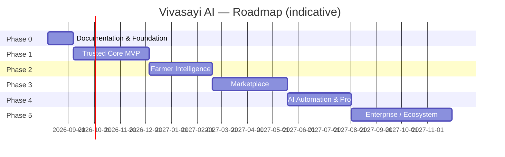

# 05 — Product Roadmap

> **Metadata**
> - **Title:** 05 — Product Roadmap
> - **Version:** 1.0
> - **Status:** `[ACTIVE]`
> - **Owner:** Product Manager / Leadership
> - **Last Reviewed:** 2026-08-07
> - **Related Documents:** [01_Product_Vision](01_Product_Vision.md) · [02_Product_Overview](02_Product_Overview.md) · [04_Feature_List](04_Feature_List.md) · [17_Backlog](../planning/17_Backlog.md) · [18_DECISIONS](../decisions/18_DECISIONS.md)

> **Why this document exists:** Translates the vision and feature list into a sequenced, measurable delivery plan. Each phase has a purpose, a feature set, concrete deliverables, and success metrics so the team and investors can track progress objectively. Phases assume a small team (1-2 engineers) and 2-week sprints; estimates are working-level, not commitments.

**Status legend:** `[EXISTING]` = shipped · `[PLANNED]` = committed to a phase · `[FUTURE]` = roadmap only.

---

## Phase 0 — Documentation & Product Foundation

> **Status: `[IN PROGRESS]` — this documentation set.** *(This phase is the reason these docs exist.)*

### Purpose
Turn the capstone prototype into an investable, onboardable product: write down the truth, set engineering standards, and create the single source of truth before building more.

### Features / Deliverables
- Complete documentation system in `docs/` (product, architecture, engineering, business, planning, decisions). `[EXISTING]`
- Architecture Decision Records for every important past + future decision. `[PLANNED]`
- Environment variable inventory + `.env.example`. `[PLANNED]`
- Git hygiene: fix `.DS_Store`/`todo.md` tracking, PR templates, branch strategy. `[PLANNED]`

### Success Metrics
- 100% of endpoints documented in 08_API_Documentation.md.
- 100% of the codebase mapped to a document.
- New engineer can start a local dev environment in < 1 hour (see 14_Deployment.md).

---

## Phase 1 — Trusted Core Decision Platform (MVP Hardening)

> **Status: `[PLANNED]` · Goal: make the demo safe, real, measurable — and a decision platform, not a chatbot.**

### Purpose
The current prototype has a working core loop but cannot carry real users: auth is forgeable, the advertised "weather/location-aware" context is not delivered, images are not analyzed, and there is zero testing. Phase 1 fixes security and delivers the core promise.

### Features
- **Security & auth:** verify JWT (signature/issuer/audience/expiry), `requireAuth` middleware, user identity from token only, rate limiting, input caps, sanitized errors, strict CORS, remove `/test` routes. `[PLANNED]`
- **Model Adapter:** extract all model access behind a provider-agnostic layer (interface `ask`/`stream`/`vision`/`embed`); Gemini becomes one configurable provider, not the only one (F-45, ADR-015, APP-05). `[PLANNED]`
- **Context Engine — first slice:** backend weather/location/soil/farm-profile auto-assembly injected into prompts (replaces dead `{{...}}` placeholders); zero-question onboarding (F-20; the full nine-domain engine F-46 completes in Phase 2 — see below, ADR-014, APP-02/03). `[PLANNED]`
- **Farm profile:** district/crops/acres onboarding as the Context Engine + Farm Memory seed (F-21). `[PLANNED]`
- **AI diagnosis pipeline:** upload → vision analysis **fused with weather/soil/crop/location context** → structured diagnosis (F-22, ADR-017, APP-07). `[PLANNED]`
- **Streaming chat (SSE).** `[PLANNED]`
- **Tamil-first onboarding:** language selection before login, suggested questions; **no re-asking for what GPS/profile can resolve** (APP-02). `[PLANNED]`
- **Testing:** unit + integration + AI evaluation harness (Tamil/English golden set, incl. context-aware rubric). `[PLANNED]`
- **Observability:** structured logs, error tracking, $/conversation dashboard. `[PLANNED]`
- **Cleanup:** dedupe session APIs, remove dead models/endpoints. `[PLANNED]`

### Deliverables
- Production-grade auth flow end-to-end.
- "The platform knows your district + weather + farm without asking" — provable in a demo (Context Engine).
- Working context-fused photo diagnosis.
- Provider swappable by config (`MODEL_PROVIDER`) with business logic untouched.
- Test suite + CI gate.
- Cost & quality dashboards.

### Success Metrics
- **Security:** no auth bypasses; OWASP top-10 items remediated (see 15_Security).
- **Answer quality:** ≥80% acceptable answers on the golden eval set (Tamil + English), incl. context-aware cases.
- **Zero-question:** ≥95% of first-time-user answers require no manual location/district entry (auto-resolved by GPS/context).
- **Latency:** first token < 2s (streaming); total answer < 8s p75.
- **Cost:** < ₹1.50 (~$0.02) per average conversation.
- **Onboarding:** 2 taps from first open to first answer; Tamil user can complete without typing.

---

## Phase 2 — Farm Memory & Intelligence (Retention)

> **Status: `[FUTURE]` · Goal: the platform remembers the farm and proactively reaches the farmer where she lives (WhatsApp).**

### Purpose
Personalize everything with the full Decision Platform: the Context Engine completes its nine domains, Farm Memory persists the farm across sessions and seasons, and the platform proactively reaches the farmer on WhatsApp.

### Features
- **Context Engine — full:** add Crop History + Government Advisories domains; GPS-driven location; season detection; missing-domain "unknown" flags. `[FUTURE]`
- **Farm Memory:** long-term farm profile/plot/crop-history/decision/outcome store surfaced in every conversation. `[FUTURE]`
- **Model Adapter — second provider:** evaluate Llama/Qwen/Mistral or self-hosted on the golden set; switch by config (APP-05/12). `[FUTURE]`
- WhatsApp bot (text + voice-note input). `[FUTURE]`
- Tamil text-to-speech output. `[FUTURE]`
- Personal crop plan generation + reminders. `[FUTURE]`
- Weather/price/pest push alerts (WhatsApp). `[FUTURE]`
- Quick-question chips + offline answer cache. `[FUTURE]`
- Engagement analytics (retention cohorts, topic distribution). `[FUTURE]`

### Deliverables
- WhatsApp-first usage path for rural users.
- Proactive alert engine.
- Farm Memory v1 (multiple plots, crop history, decisions/outcomes).

### Success Metrics
- **Retention:** Week-2 retention ≥ 40% of activated users.
- **Depth:** ≥ 5 questions / active user / week.
- **Channel mix:** WhatsApp ≥ 50% of conversations.
- **NPS:** ≥ 40 among Tamil farmers (measured via simple 1-question voice surveys).

---

## Phase 3 — Marketplace (First Revenue)

> **Status: `[FUTURE]` · Goal: monetize reach via local commerce.**

### Purpose
Turn conversational demand ("I need tomato fungicide") into verified local supply (dealer directory) and paid leads — the first scalable revenue stream without charging farmers.

### Features
- Verified local agri-input dealer profiles. `[FUTURE]`
- Product/service matching from conversation context. `[FUTURE]`
- Pay-per-lead / visibility offering (disclosed). `[FUTURE]`
- Mandi price feeds (sourced) in chat. `[FUTURE]`

### Deliverables
- Dealer partner onboarding (with FPO/area verification).
- Lead-delivery workflow on WhatsApp.
- Pricing/packaging for dealer subscriptions.

### Success Metrics
- **Supply:** ≥ 200 verified dealers across 3 pilot districts.
- **Demand:** ≥ 10k MAU in pilot districts.
- **Revenue:** first ₹1L/month (~$1.2k) from dealer subscriptions/leads.
- **Farmer trust:** dealer-satisfaction follow-up ≥ 4/5.

---

## Phase 4 — AI Automation & Pro (Subscription Revenue)

> **Status: `[FUTURE]` · Goal: high-margin paid tiers + expert loop.**

### Purpose
Monetize the individual power-user and add a human-expert layer that increases trust and handles the long tail of complex cases.

### Features
- **CropDoctor Pro:** unlimited diagnoses, multi-image, expert escalation. `[FUTURE]`
- Premium tiers + usage metering (Flash vs Pro model, chat quotas). `[FUTURE]`
- Farm recordkeeping (digital diary, reports). `[FUTURE]`
- Expert consultation marketplace (verified agronomists). `[FUTURE]`
- Payment stack (UPI/cards, subscriptions). `[FUTURE]`

### Deliverables
- Payment integration + billing.
- Expert verification + escalation queue.
- Recordkeeping module.

### Success Metrics
- **Conversion:** ≥ 3% of active users on a paid tier within 6 months.
- **Revenue:** subscription + marketplace ≥ ₹5L/month (~$6k).
- **Expert satisfaction:** escalation resolution < 24h; expert NPS ≥ 50.
- **Margin:** gross margin ≥ 70% on paid tier.

---

## Phase 5 — Enterprise / Ecosystem (Scale)

> **Status: `[FUTURE]` · Goal: B2B + government + multi-state.**

### Purpose
Sell the accumulated, consented, de-identified intelligence and platform capability to institutions that serve agriculture at scale, and expand beyond Tamil Nadu.

### Features
- B2B analytics dashboards (FPOs, input companies, government). `[FUTURE]`
- Government scheme auto-matching + extension program integration. `[FUTURE]`
- TNAU/ICAR content licensing into the knowledge base. `[FUTURE]`
- FPO management tooling. `[FUTURE]`
- Knowledge-pack expansion to other states/languages. `[FUTURE]`

### Deliverables
- Institutional sales collateral + pilot agreements.
- Data-consent + de-identification framework.
- Multi-state onboarding runbook.

### Success Metrics
- **Enterprise revenue:** ≥ 2 institutional contracts.
- **Reach:** ≥ 500k registered farmers.
- **Unit economics:** CAC payback < 6 months on paid tiers.
- **Impact (investor-grade):** measurable adoption/yield outcomes from pilot programs.

---

## Summary Timeline

## Phase exit criteria

A phase is **complete** only when all its success metrics are met — not when the features are merged. Each phase has a go/no-go gate before the next begins (see [18_DECISIONS.md](../decisions/18_DECISIONS.md) for the decision record convention).
