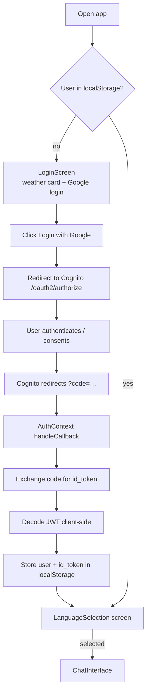
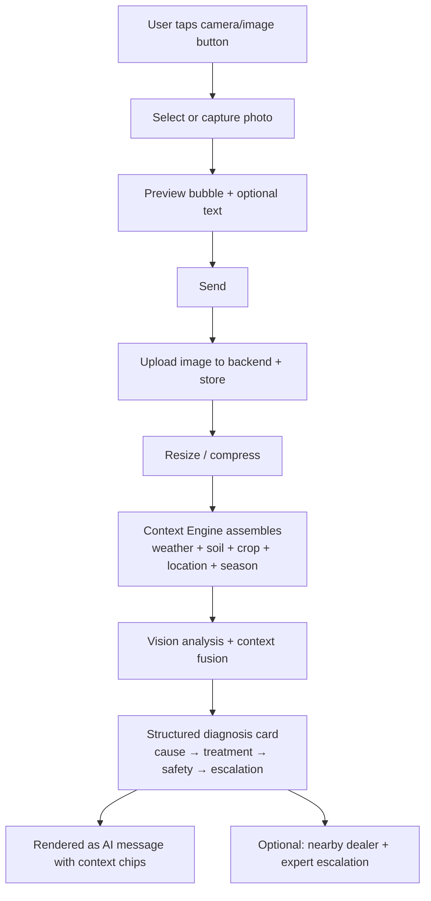
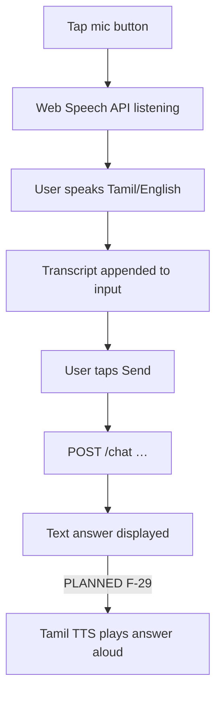
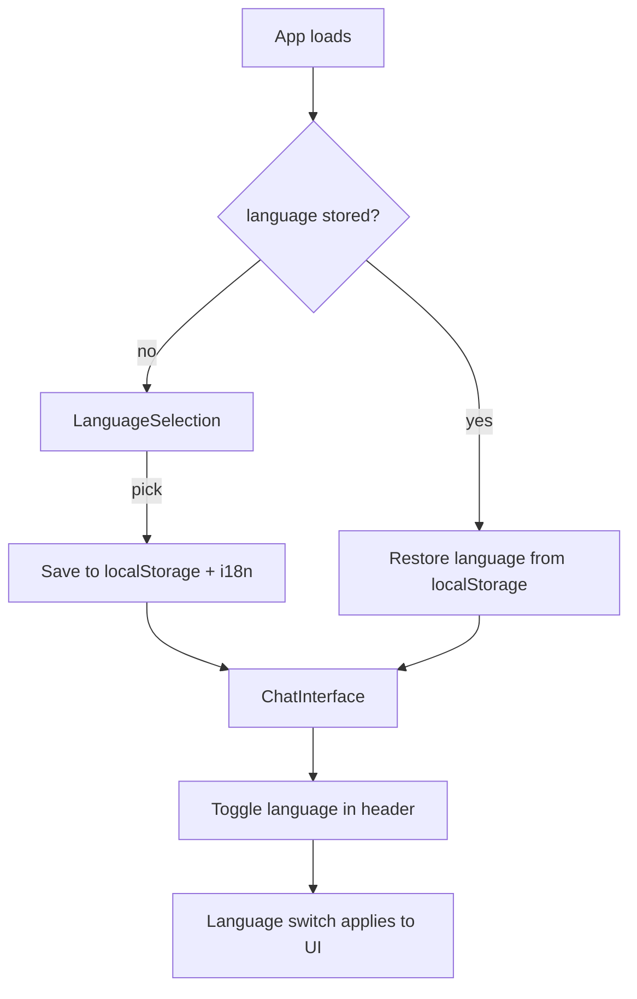
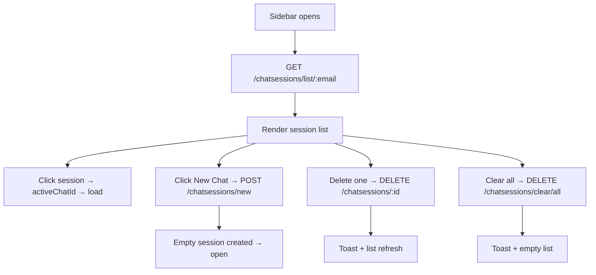

# 10 — User Flows

> **Metadata**
> - **Title:** 10 — User Flows
> - **Version:** 1.0
> - **Status:** `[ACTIVE]`
> - **Owner:** Product / Design / QA
> - **Last Reviewed:** 2026-08-07
> - **Related Documents:** [03_Target_Users](03_Target_Users.md) · [11_UI_UX_Guidelines](11_UI_UX_Guidelines.md) · [13_Testing_Strategy](../engineering/13_Testing_Strategy.md)

> **Why this document exists:** A shared, visual reference of every primary user journey. Used by PM (design decisions), designers (screen transitions), QA (test scenarios), and developers (state machines). Flows describe **today's behavior** unless marked `[PLANNED]`/`[FUTURE]`.

---

## 1. Login (Google / Cognito)



**Notes / gaps:**
- Language is chosen **after** login; a Tamil-only user sees an English login screen first (onboarding gap → F-Tamil-first onboarding, Phase 1).
- Weather loads on the login screen before sign-in (geolocation prompt appears pre-auth).
- Session restoration is client-side only (`localStorage`); no token refresh/expiry handling.

---

## 2. Chat (send message)

```mermaid
flowchart TD
    A[ChatInterface open] --> B{activeChatId?}
    B -- yes --> C[GET /chatsessions/:id → load messages]
    B -- no --> D[empty thread]
    C --> E[User types / speaks / picks image]
    D --> E
    E --> F{valid input?}
    F -- no --> E
    F -- yes --> G[Optimistic user bubble]
    G --> H[POST /chat {message, chatId?, userEmail, language}]
    H --> I[Backend: Context Engine assembles<br/>farm profile + GPS + weather + soil + season + history + RAG]
    I --> J{Response}
    J -- ok + new chatId --> K[Set activeChatId]
    J -- ok --> L[Append AI bubble with res.data.response<br/>+ context chips: 'Thanjavur · Paddy · 32°C · loamy']
    J -- error --> M[Error bubble: Server error / No response]
    K --> L
    L --> N[Scroll to bottom]
    L --> O[onMessageSent → refresh sidebar]
```

**Notes / gaps:**
- Backend latency 5-15s with a spinner; no streaming (F-23 planned).
- `language` is sent but ignored server-side.
- Images are previewed but dropped before the API call today (F-15); with the Context Engine + diagnosis pipeline the POST carries the image and the backend fuses context (F-22, F-46).
- **Today the backend does NOT auto-assemble context** (no Context Engine yet — F-46). The `I` step above is the vision-v2 target; today the LLM receives conversation memory + RAG chunks only.

---

## 3. AI diagnosis pipeline (image + context fusion) `[PLANNED — flow describes target]`



**Today:** only B → C works. The rest is Phase 1 (F-22, F-46) — and, per APP-07, an image is **never analyzed in isolation**: vision output is fused with the assembled context before any recommendation is produced. See [09_AI_Architecture.md](../architecture/09_AI_Architecture.md) §6.

---

## 4. Voice chat (speech-to-text)



**Notes:** transcription quality depends on browser + language support; Tamil coverage varies by device. No TTS today.

---

## 5. Weather (login screen)

```mermaid
flowchart TD
    A[LoginScreen mounts] --> B[getFarmerLocation]
    B --> C{geolocation available?}
    C -- no --> D[Default: Chennai]
    C -- yes, success --> E{Inside TN bounds?}
    E -- yes --> F[Find nearest of 38 districts]
    E -- no --> G[Demo district (rotates by weekday)]
    D --> H[Open-Meteo forecast]
    F --> H
    G --> H
    H -- ok --> I[Farmer weather card + 7-day forecast]
    H -- error --> J[Fallback static weather]
    I --> K[User logs in]
```

**Notes:** demo mode is flagged to the user when outside Tamil Nadu. Weather is not passed to the AI today (F-20 planned); once the Context Engine ships, the backend also fetches weather server-side (cached) for the AI prompt — the frontend card becomes a *display* of the same data, and the farmer is never re-asked for location (zero-question, APP-02).

---

## 6. Profile / language



**Notes / gaps:**
- `User.language` is never written to the backend (`updateUserLanguage` is client-only). Farm profile does not exist yet (F-21 planned).
- **Zero-question direction (F-46):** onboarding auto-resolves district from GPS and pre-fills the farm profile from context, so the farmer is not asked to select district/crops by hand where the platform can know them.

---

## 7. Chat history (sidebar)



**Notes:** ownership checks rely on `userEmail` in the request body (spoofable — Phase 1 F-19). No confirmation dialog for delete in current UI (keys exist in i18n but not wired).

---

## 8. Logout

```mermaid
flowchart TD
    A[Header logout button] --> B[remove user + id_token from localStorage]
    B --> C[setUser(null)]
    C --> D[LoginScreen shown]
    D --> E{language kept?}
    E -- yes --> F[Language preference retained in localStorage]
```

**Notes:** client-side logout only; Cognito session/token is not revoked. No "remember me"/refresh flow.

---

## 9. User-flow → test-scenario mapping

| Flow | Primary test scenarios (see 13_Testing_Strategy) |
|---|---|
| Login | fresh login, restore session, invalid code, login failure, logout + relogin |
| Chat | new chat, follow-up context, empty message, very long message, server error, network error |
| Context (planned) | GPS resolves district; GPS denied → graceful "unknown"; profile missing; domain fetch failures degrade with flags |
| Image diagnosis (planned) | valid image, corrupt file, oversize, no vision result, context-fused output shows weather/soil/crop |
| Voice | permission denied, transcript partial, no speech |
| Weather | inside TN, outside TN (demo), geolocation denied, API failure |
| History | create, open, delete, clear-all, cross-user isolation (negative) |
